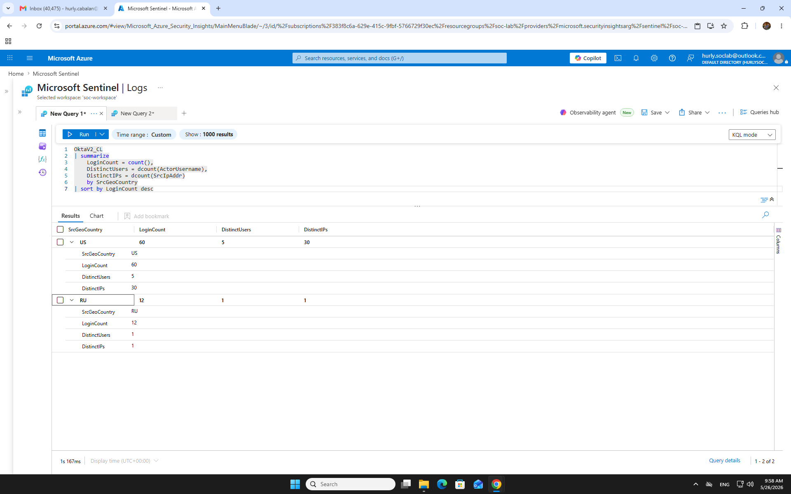
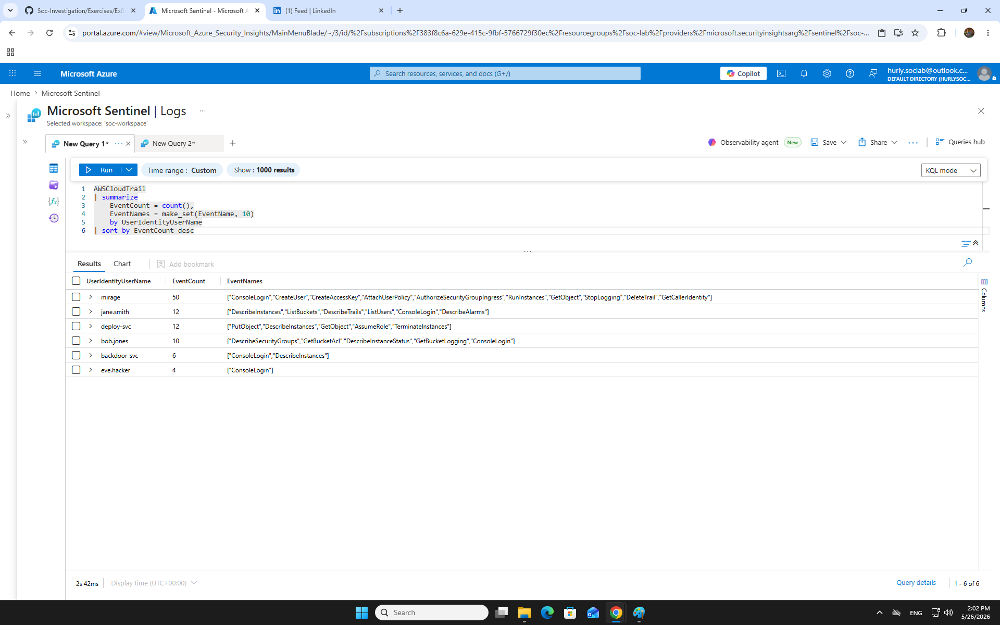
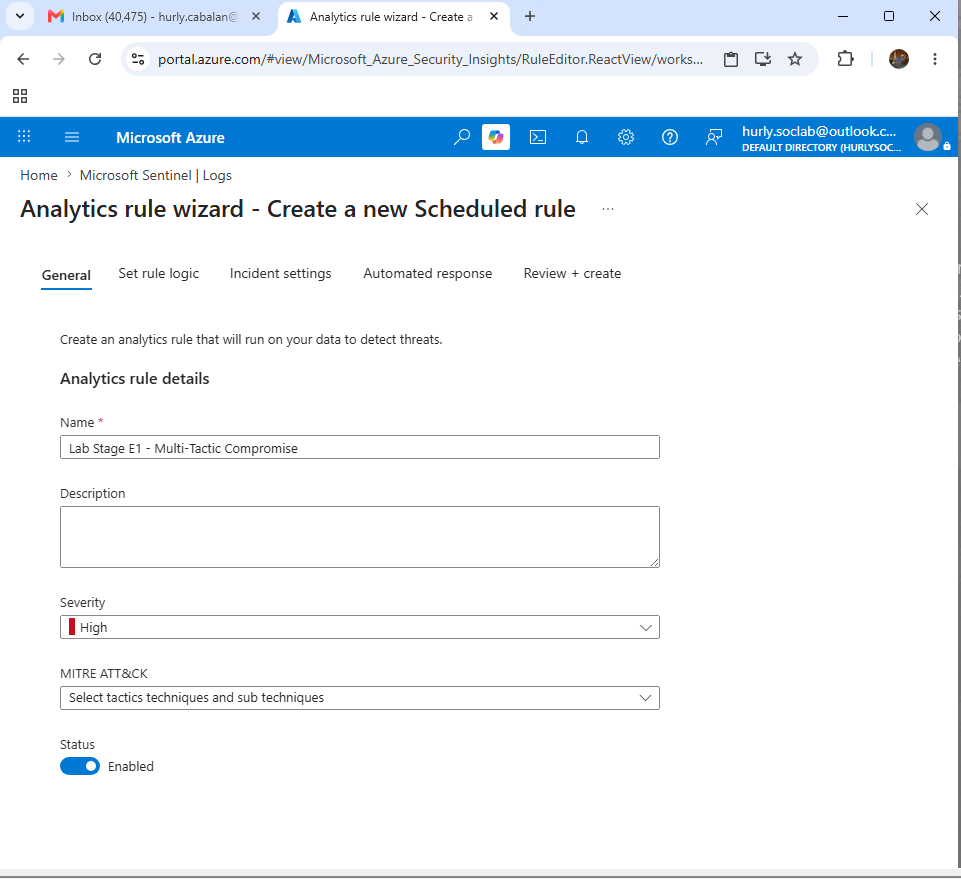
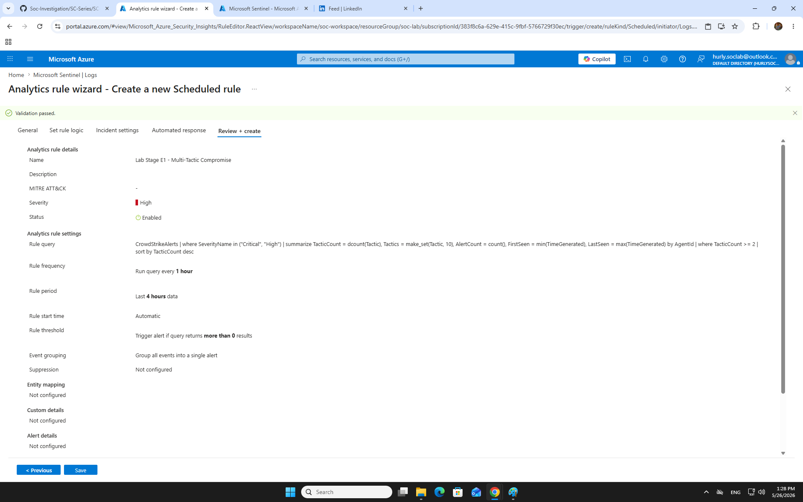
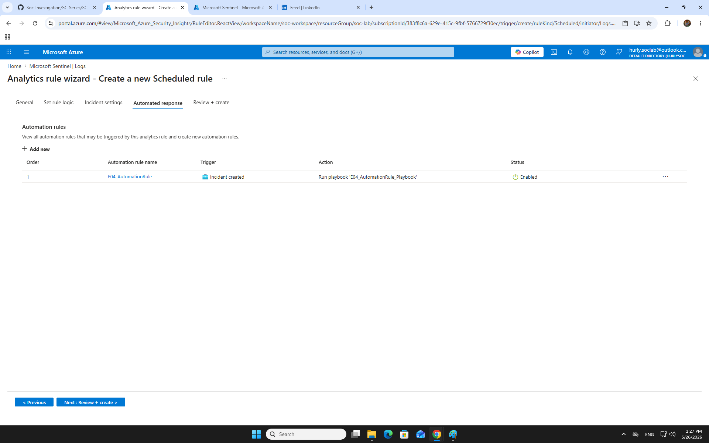
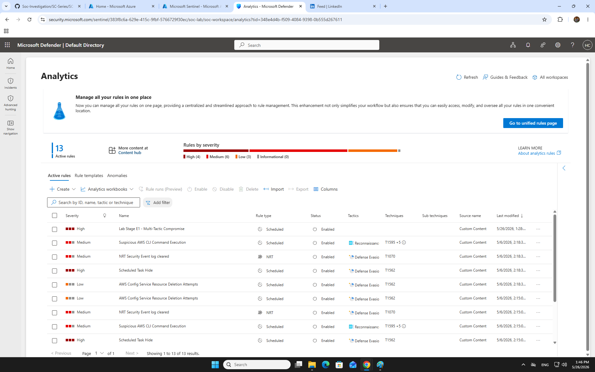

# Exercise 01 — Exploration: Hunting Across Your Data

**SC-200 Domain:** D3 Microsoft Sentinel (50–55%) | D1 Defender XDR (25–30%)  
**Difficulty:** Beginner | **Status:** ✅ Complete

---

## What This Exercise Covers

Before building detections, a SOC analyst's first job is to understand the data — what tables exist, what events they contain, and what patterns are worth alerting on. This exercise covers **Advanced Hunting** data exploration across six data sources and converts a hunting query into a **custom detection rule**. This is the most foundational Sentinel skill: you can't detect what you haven't explored.

---

## Data Sources Explored

| Table | Source | Data Type |
|-------|--------|-----------|
| `CrowdStrikeAlerts` | CrowdStrike EDR | Endpoint alerts with MITRE tactic mapping |
| `CrowdStrikeDetections` | CrowdStrike EDR | Raw detection events |
| `CommonSecurityLog` | Palo Alto NGFW | Firewall traffic (allow/deny/drop) |
| `OktaV2_CL` | Okta IdP | Identity and authentication events |
| `AWSCloudTrail` | AWS | Cloud API call audit log |
| `MailGuard365_Threats_CL` | MailGuard | Email threat telemetry |

---

## Lab Steps Completed

### Step 1 — Discover Available Tables

Ran `search *` to inventory all tables with data and event counts.

```kql
search *
| summarize EventCount = count() by $table
| sort by EventCount desc
```

**Why this query:** Fastest way to see the entire data landscape. `$table` is a special column that returns the source table name — it only works with `search *`. This is the SOC equivalent of opening a new case file and checking what evidence you have.


---

### Step 2 — Explore CrowdStrike Endpoint Alerts

```kql
CrowdStrikeAlerts
| summarize AlertCount = count() by Name, SeverityName, Tactic
| sort by AlertCount desc
```

**Key insight:** Multiple MITRE tactics visible (Initial Access → Credential Access → Lateral Movement) on the same device = multi-stage compromise. Single-tactic alerts can be noise. Multi-tactic on one host is a high-confidence TP signal.


---

### Step 3 — Explore Palo Alto Firewall Traffic

```kql
CommonSecurityLog
| where DeviceVendor == "Palo Alto Networks"
| where Activity in ("drop", "deny", "reset-both")
| summarize
    BlockedConnections = count(),
    TargetedPorts = dcount(DestinationPort)
    by SourceIP
| sort by BlockedConnections desc
| take 10
```

**Why `Activity in (...)`:** Palo Alto uses multiple action values for blocked traffic. The `in` operator checks all three in a single filter — cleaner than chaining `or` conditions. On the SC-200 exam, `in` is a key operator for multi-value filtering.


---

### Step 4 — Explore Okta Identity Events

> **Lab note:** Original failed-login query returned no results in the custom time range. Substituted with geo-distribution query to confirm login anomaly across countries.

```kql
OktaV2_CL
| summarize
    LoginCount = count(),
    DistinctUsers = dcount(ActorUsername),
    DistinctIPs = dcount(SrcIpAddr)
    by SrcGeoCountry
| sort by LoginCount desc
```

**Finding:** US = 60 logins (5 users, 30 IPs). RU = 12 logins (1 user, 1 IP) — anomalous single-user login pattern from Russia flagged as geo-anomaly.



---

### Step 5 — Explore AWS CloudTrail

```kql
AWSCloudTrail
| summarize
    EventCount = count(),
    EventNames = make_set(EventName, 10)
    by UserIdentityUserName
| sort by EventCount desc
```

**Key finding:** User `mirage` — 50 events including `StopLogging`, `DeleteTrail`, `CreateUser`, `CreateAccessKey`, `AttachUserPolicy`. Classic attacker pattern: disable logging first, then establish persistence.



---

### Step 6 — Build a Cross-Source Timeline

```kql
union
    (CrowdStrikeAlerts
    | where SeverityName in ("Critical", "High")
    | project TimeGenerated, Source = "CrowdStrike", Activity = Name, Severity = SeverityName),
    (CommonSecurityLog
    | where DeviceVendor == "Palo Alto Networks"
    | where DeviceEventClassID == "THREAT"
    | project TimeGenerated, Source = "Palo Alto", Activity = Activity, Severity = LogSeverity),
    (OktaV2_CL
    | where EventOriginalType has "mfa" or EventOriginalType has "deactivate"
    | project TimeGenerated, Source = "Okta", Activity = EventOriginalType, Severity = EventSeverity),
    (AWSCloudTrail
    | where EventName in ("CreateUser", "AttachUserPolicy", "CreateAccessKey", "StopLogging")
    | project TimeGenerated, Source = "AWS", Activity = EventName, Severity = "High")
| sort by TimeGenerated asc
```

**Why this matters:** The `union` operator is the multi-source foundation of all kill-chain investigations. Normalize each source into matching columns, sort by time — this IS the investigation timeline.


---

### Step 7 — Write the Detection Query

Query to detect endpoints with CrowdStrike alerts spanning multiple MITRE ATT&CK tactics — a strong compromise indicator.

```kql
CrowdStrikeAlerts
| where SeverityName in ("Critical", "High")
| summarize
    TacticCount = dcount(Tactic),
    Tactics = make_set(Tactic, 10),
    AlertCount = count(),
    FirstSeen = min(TimeGenerated),
    LastSeen = max(TimeGenerated)
    by AgentId
| where TacticCount >= 2
| sort by TacticCount desc
```


---

### Step 8 — Create the Custom Detection Rule

Converted the hunting query into a scheduled analytics rule via Microsoft Sentinel Analytics wizard.

**Rule configuration:**

| Field | Value |
|-------|-------|
| **Name** | `Lab Stage E1 - Multi-Tactic Compromise on Single Device` |
| **Severity** | High |
| **Status** | Enabled |
| **Frequency** | Every 1 hour |
| **Lookback** | 4 hours |
| **Threshold** | Trigger if results > 0 |
| **Automation** | E04_AutomationRule → Run playbook `E04_AutomationRule_Playbook` |





---

### Step 9 — Verify the Rule is Active

Navigated to Defender portal → Microsoft Sentinel → Configuration → Analytics → confirmed rule appears as Enabled.



---

## SC-200 Exam Relevance

| Concept Practiced | SC-200 Domain | Exam Topic |
|-------------------|---------------|------------|
| `search *` for data discovery | D3 Sentinel | Advanced Hunting exploration |
| `summarize` with aggregation | D3 Sentinel | KQL fundamentals |
| `union` for multi-source queries | D3 Sentinel | Cross-table hunting |
| `in` operator for multi-value filter | D3 Sentinel | KQL operators |
| Custom detection rule creation | D1 Defender XDR | Custom detections |
| Schedule, lookback, entity mapping | D1 Defender XDR | Rule configuration |

**Key exam distinction:** Custom detection rules live in **Microsoft Defender portal → Advanced Hunting** and produce **Alerts**. Sentinel analytics rules live in **Sentinel → Analytics** and produce **Incidents**. Know which UI, which output.

---

## MITRE ATT&CK

| Technique | ID | Detection Logic |
|-----------|----|-----------------|
| Multi-stage attack pattern | Multiple | TacticCount ≥ 2 on single device |
| Network Service Discovery | T1046 | Port scan detection via Palo Alto |
| Credential Access | T1003 | CrowdStrike alert tactic classification |
| Defense Evasion: Impair Defenses | T1562 | AWS StopLogging + DeleteTrail |
| Persistence | T1136 | AWS CreateUser + AttachUserPolicy |

---

## Key Takeaways

- `search *` is the fastest table discovery tool — use it first when unfamiliar with a workspace
- `dcount()` counts **distinct** values — use it to detect diversity (distinct ports, distinct tactics, distinct countries)
- `union` normalizes multiple tables into a single timeline — the foundation of all multi-source investigations
- A good detection combines **aggregation** (`summarize`) with a **threshold** (`where TacticCount >= 2`)
- User `mirage` in AWSCloudTrail = textbook attacker: disable logging → create backdoor user → attach policy → persist

---

*Portfolio: [github.com/hurlycabalan/Soc-Investigation](https://github.com/hurlycabalan/Soc-Investigation)*
