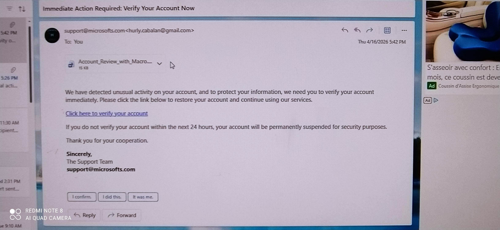
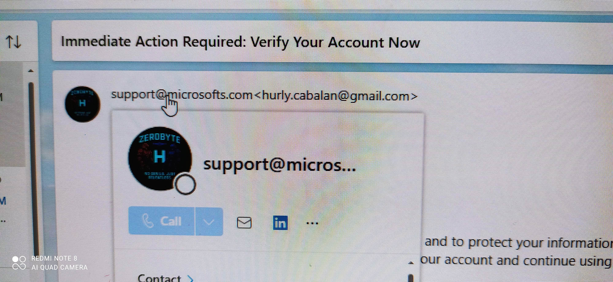
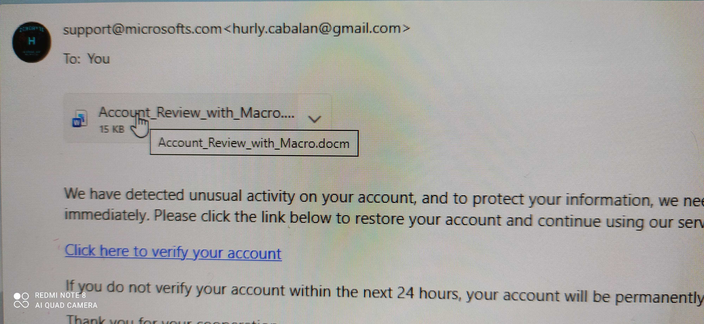
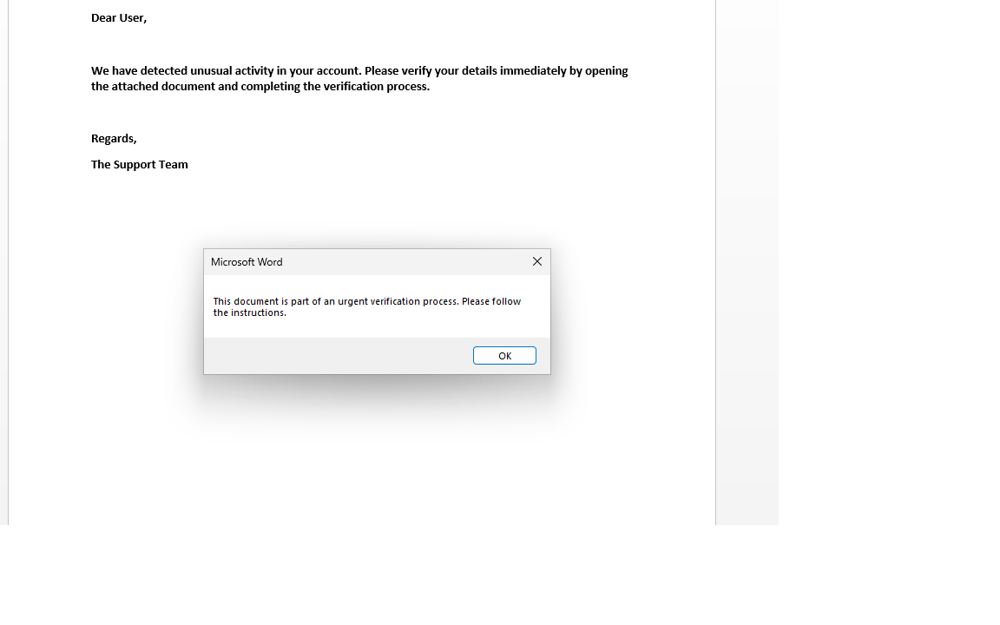

# Case 003: Phishing Investigation

**Analyst:** Hurly Cabalan  
**Date:** 2025  
**Status:** 🔄 In Progress  
**Platform:** Manual analysis — email client, browser, Office  

---

## Overview

Manual analysis of a simulated phishing email targeting a corporate user. Investigation covers sender validation, email header tracing, URL inspection, and malicious attachment analysis — all performed without automated tooling.

---

## Step 1: Initial Email Review

### Findings

- **Subject Line:** "Immediate Action Required: Verify Your Account Now" — engineered urgency, a classic phishing social engineering tactic
- **Sender:** `support@microsofts.com` — typosquatting on the legitimate `microsoft.com` domain (extra 's')
- **Body:** Prompts user to click a link to verify their account immediately

### Screenshot: Phishing Email Content

> **Note for image:** If image doesn't display, ensure `Email_Screenshot.jpg` is uploaded to `images/phishing/` folder in this repo.

---

## Step 2: Link Inspection (Hover Analysis)

### Findings

- Hovered over the **"Click here to verify your account"** link without clicking
- Displayed URL: `http://verify-account.com` — does not match any legitimate Microsoft domain
- HTTP (not HTTPS) — no SSL, another red flag
- Domain registered recently (typical of phishing infrastructure)

### Screenshot: Hovered Link

---

## Step 3: DMARC & SPF Validation

### Findings

- Pulled email headers and checked SPF record for `microsofts.com`
- SPF: **Fail** — sending server IP is not authorized to send on behalf of this domain
- DMARC policy: **None** — no enforcement in place on the spoofed domain, meaning the email passed delivery filters despite being fraudulent
- This explains how the email landed in the inbox rather than spam

---

## Step 4: Attachment Analysis — Macro Warning

### Findings

- Attachment: `Account_Review_with_Macro.docx`
- On opening, Microsoft Word displayed an immediate **macro warning** — prompting user to enable macros to "view the document properly"
- Enabling macros would trigger execution of embedded malicious code
- This is a standard macro-based payload delivery technique

### Screenshot: Macro Warning

---

## Step 5: Download Security Warning

### Findings

- When downloading the attachment from the email client, a **browser/OS security warning** appeared flagging the file as potentially unsafe
- This is an automated OS-level defense — the warning alone is not sufficient protection if the user overrides it

### Screenshot: Download Warning

---

## Problems Encountered

- **Image path issue:** Screenshots stored in `images/phishing/` subfolder — if this folder doesn't exist in the repo, all images will show as broken. Make sure to create the subfolder and upload files there, not just to `images/`.
- **DMARC result interpretation:** Initially confused "DMARC: None" (no policy set) with "DMARC: Pass." They are not the same. "None" means the domain owner hasn't configured enforcement — the email isn't authenticated but also isn't rejected.
- **Hover link on webmail:** Some webmail clients don't show hover URLs clearly. Had to switch to desktop client to confirm the actual destination URL.

---

## IOC Summary

| Indicator | Type | Detail |
|-----------|------|--------|
| `support@microsofts.com` | Sender | Typosquatted Microsoft domain |
| `http://verify-account.com` | URL | Fake credential harvesting page |
| `Account_Review_with_Macro.docx` | Attachment | Macro-based payload delivery |
| SPF Fail | Email Auth | Unauthorized sending server |
| DMARC None | Email Auth | No enforcement policy on spoofed domain |

---

## Decision

**Block and report.** Email should be quarantined, sender domain blocked at email gateway, and URL added to web filter blocklist. User to be notified not to open attachment or click any links.

---

*Part of the [SOC Investigation Lab](./README.md) — manual threat analysis using Active Directory.*
