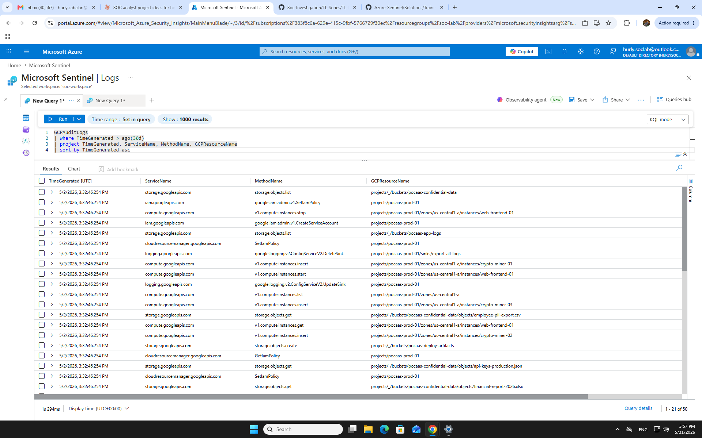
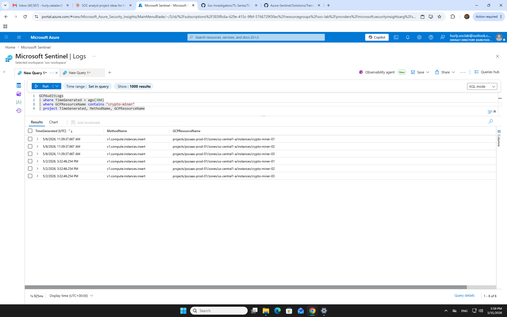
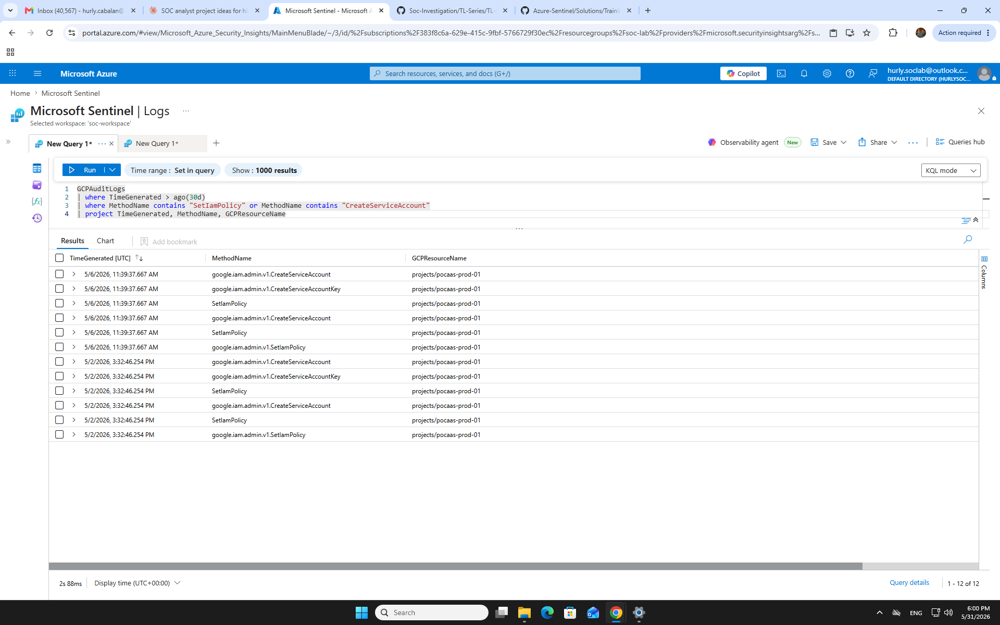
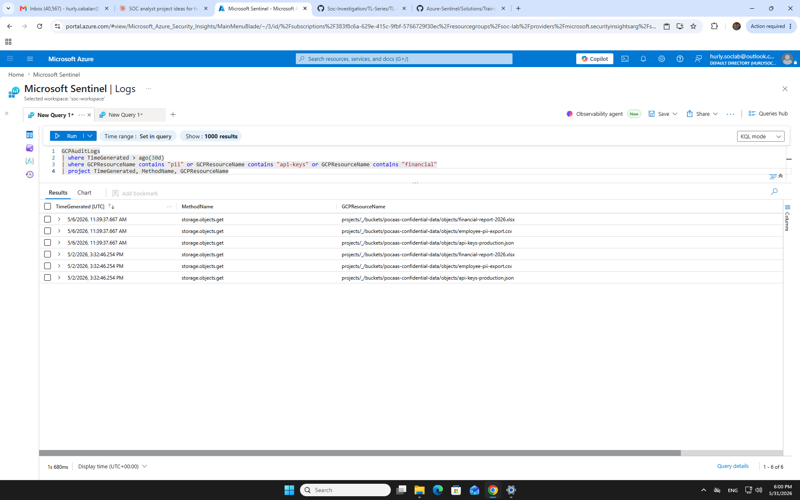
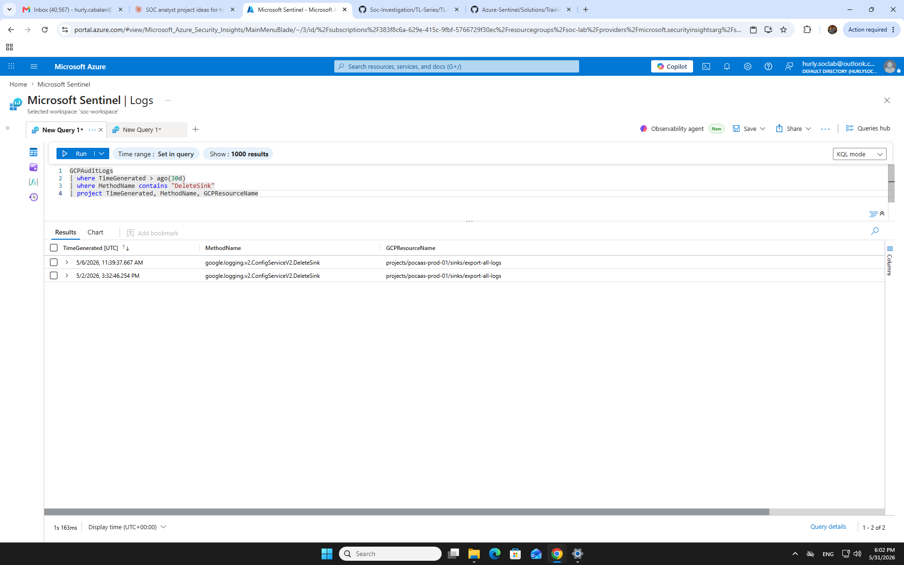

# SC-06 — GCP Cloud Attack: Privilege Escalation, Cryptomining & Data Exfiltration

## Plain English Summary

In this investigation, I detected a multi-stage cloud attack against a GCP production environment (`pocaas-prod-01`). A threat actor using a rogue service account escalated IAM privileges, deleted audit log exports to cover their tracks, stole production API keys and sensitive employee and financial data, and deployed three cryptomining instances. The attack occurred in two separate waves — May 2 and May 6, 2026 — indicating a persistent threat actor who returned after the initial compromise. I confirmed this as a Critical True Positive and documented containment and hardening recommendations.

---

## Section 1 — Scenario Overview

| Field | Detail |
|---|---|
| **Environment** | Microsoft Sentinel — `soc-workspace` |
| **Data Source** | `GCPAuditLogs` — Google Cloud Platform Audit Logs |
| **Threat Actor** | `rogue-actor` service account · CallerIP `198.51.100.42` |
| **Target Project** | `pocaas-prod-01` |
| **Attack Wave 1** | 5/2/2026, 3:32 PM UTC |
| **Attack Wave 2** | 5/6/2026, 11:39 AM UTC |
| **Severity** | 🔴 Critical |
| **Outcome** | True Positive — Confirmed cloud compromise |

**Hypothesis:** Unusual IAM activity (service account creation + policy escalation) followed by compute instance creation and storage access in a production GCP project indicates a cloud account takeover, data exfiltration, and resource hijacking scenario. The recurrence of identical actions 4 days apart suggests the attacker established persistence and returned.

---

## Section 2 — Investigation

> All queries run against `GCPAuditLogs` in Microsoft Sentinel. Data source: pre-recorded Sentinel Training Lab logs. Lab environment: `hurly.soclab@outlook.com` / `soc-workspace`.

---

### Query 1 — Full Attack Scope

**Hypothesis:** Understand the full breadth of attacker actions across all GCP services before narrowing focus.

**Why this query:** Starting broad establishes scope and surfaces unexpected services or resources touched by the attacker.

```kql
GCPAuditLogs
| where TimeGenerated > ago(30d)
| project TimeGenerated, ServiceName, MethodName, GCPResourceName
| sort by TimeGenerated asc
```

**Expected:** A mix of IAM, compute, storage, and logging events if this is a real attack.

**Actual:** 50 rows across `iam.googleapis.com`, `compute.googleapis.com`, `storage.googleapis.com`, `logging.googleapis.com`, and `cloudresourcemanager.googleapis.com`. Two distinct time clusters confirmed — Wave 1 (5/2) and Wave 2 (5/6).

**Decision:** Scope confirmed. Proceeding to targeted phase-by-phase queries.



---

### Query 2 — Privilege Escalation

**Hypothesis:** Attacker created rogue service accounts and escalated IAM permissions to gain persistent elevated access.

**Why this query:** `CreateServiceAccount` and `SetIamPolicy` are the two most common IAM abuse methods in GCP privilege escalation. Filtering both together reveals the full escalation chain.

```kql
GCPAuditLogs
| where TimeGenerated > ago(30d)
| where MethodName contains "SetIamPolicy" or MethodName contains "CreateServiceAccount"
| project TimeGenerated, MethodName, GCPResourceName
```

**Expected:** A sequence of CreateServiceAccount → CreateServiceAccountKey → SetIamPolicy if escalation occurred.

**Actual:** 12 rows — attacker created multiple rogue service accounts, generated keys (`CreateServiceAccountKey`), and escalated permissions via `SetIamPolicy` and `google.iam.admin.v1.SetIamPolicy`. Pattern repeated in both attack waves.

**Decision:** Confirmed privilege escalation. Attacker achieved persistent elevated IAM access.



---

### Query 3 — Defense Evasion: Audit Log Deletion

**Hypothesis:** Attacker deleted log export sinks to destroy the audit trail and impair detection.

**Why this query:** `DeleteSink` targeting `export-all-logs` is a deliberate evasion action — the attacker knew logs were being exported and attempted to eliminate that export. This is high-confidence malicious intent.

```kql
GCPAuditLogs
| where TimeGenerated > ago(30d)
| where MethodName contains "DeleteSink"
| project TimeGenerated, MethodName, GCPResourceName
```

**Expected:** DeleteSink event on a log export resource if evasion was attempted.

**Actual:** 2 rows — `google.logging.v2.ConfigServiceV2.DeleteSink` targeting `projects/pocaas-prod-01/sinks/export-all-logs` in both attack waves. Attacker attempted to destroy the audit trail on both occasions.

**Decision:** Confirmed defense evasion. This is the most significant indicator of deliberate, sophisticated attacker behavior.



---

### Query 4 — Data Exfiltration & Credential Theft

**Hypothesis:** Attacker accessed sensitive storage objects to steal credentials and exfiltrate confidential data.

**Why this query:** Filtering by resource names containing `pii`, `api-keys`, and `financial` isolates the highest-value targets in the `pocaas-confidential-data` bucket.

```kql
GCPAuditLogs
| where TimeGenerated > ago(30d)
| where GCPResourceName contains "pii" or GCPResourceName contains "api-keys" or GCPResourceName contains "financial"
| project TimeGenerated, MethodName, GCPResourceName
```

**Expected:** `storage.objects.get` events on sensitive files if exfiltration occurred.

**Actual:** 6 rows — attacker accessed `employee-pii-export.csv`, `api-keys-production.json`, and `financial-report-2026.xlsx` via `storage.objects.get` in both attack waves.

**Decision:** Confirmed credential theft and data exfiltration. Three high-value data categories compromised: employee PII, production credentials, and financial records.



---

### Query 5 — Impact: Cryptominer Deployment

**Hypothesis:** Attacker used elevated compute permissions to deploy unauthorized cryptomining instances for financial gain.

**Why this query:** Filtering `GCPResourceName` for `crypto-miner` isolates the impact phase — compute instances created for resource hijacking.

```kql
GCPAuditLogs
| where TimeGenerated > ago(30d)
| where GCPResourceName contains "crypto-miner"
| project TimeGenerated, MethodName, GCPResourceName
```

**Expected:** `v1.compute.instances.insert` events on instances with suspicious names if resource hijacking occurred.

**Actual:** 6 rows — `crypto-miner-01`, `crypto-miner-02`, and `crypto-miner-03` deployed via `v1.compute.instances.insert` in both attack waves (3 instances per wave). All in `us-central1-a`.

**Decision:** Confirmed resource hijacking. Three cryptomining instances deployed twice — attacker re-deployed after initial wave, indicating they expected to be removed and had a redeployment plan.



---

## Section 3 — TP/FP Decision

### Verdict: 🔴 TRUE POSITIVE — CRITICAL

**Evidence chain:**

1. Rogue service accounts created and assigned elevated IAM roles → **Privilege Escalation confirmed**
2. `export-all-logs` sink deleted in both waves → **Deliberate evasion — not an accident**
3. `api-keys-production.json` accessed → **Production credentials compromised**
4. `employee-pii-export.csv` and `financial-report-2026.xlsx` accessed → **Data breach confirmed**
5. Three cryptomining instances deployed twice → **Persistent resource hijacking**
6. Identical attack pattern on 5/2 and 5/6 → **Attacker returned — persistence established**

### FP Branch Considered

**Could this be authorized admin activity?**

No. Legitimate admin actions would not:
- Delete the `export-all-logs` audit sink — no legitimate reason to destroy your own audit trail
- Access PII + production credentials + financial data in a single session
- Deploy compute instances explicitly named `crypto-miner-*`
- Repeat the identical action sequence 4 days later with a separate service account

A single anomaly could be explained. Six correlated indicators across two attack waves eliminate all benign explanations.

### Severity Rubric

| Dimension | Rating | Reason |
|---|---|---|
| Confidentiality | 🔴 Critical | PII + API keys + financial data confirmed accessed |
| Integrity | 🔴 Critical | IAM policies modified; audit logs deleted |
| Availability | 🟠 High | Legitimate instance stopped; compute resources consumed by miners |
| Blast Radius | 🔴 Critical | Production credentials stolen — all dependent services at risk |

---

## Section 4 — MITRE ATT&CK Mapping

| Tactic | Technique | ID | Evidence |
|---|---|---|---|
| Discovery | Cloud Infrastructure Discovery | T1580 | `storage.objects.list` on `pocaas-confidential-data` and `pocaas-app-logs` buckets |
| Privilege Escalation | Account Manipulation: Additional Cloud Credentials | T1098.001 | `CreateServiceAccount` + `CreateServiceAccountKey` + `SetIamPolicy` × 12 events |
| Defense Evasion | Impair Defenses: Disable Cloud Logs | T1562.008 | `DeleteSink` on `export-all-logs` in both attack waves |
| Credential Access | Credentials in Files | T1552.001 | `storage.objects.get` on `api-keys-production.json` |
| Exfiltration | Data from Cloud Storage | T1530 | `storage.objects.get` on `employee-pii-export.csv` + `financial-report-2026.xlsx` |
| Impact | Resource Hijacking | T1496 | `v1.compute.instances.insert` — `crypto-miner-01`, `02`, `03` deployed twice |

---

## Section 5 — Hardening Recommendations

> 🟠 *AZ-500 | D1–D4 Controls ⚠️ THEORETICAL — Hands-on Month 2–3*

### D1 — Identity & Access Controls
- Enforce least-privilege IAM — remove `owner` and `editor` bindings from all service accounts
- Enable **IAM Recommender** to automatically flag over-privileged accounts
- Require **Workload Identity Federation** instead of downloadable service account keys
- Alert on `CreateServiceAccount` + `SetIamPolicy` within the same session window

### D2 — Storage & Data Protection
- Apply **VPC Service Controls** to restrict `pocaas-confidential-data` bucket access by identity and network perimeter
- Enable **Cloud DLP** scanning on buckets tagged as containing PII or financial data
- Enforce **Object Versioning** and retention policies — prevent silent data deletion
- Tag and classify sensitive buckets; enforce access only via approved service identities

### D3 — Logging & Detection
- Restore `export-all-logs` sink immediately to an **immutable destination** (Cloud Storage bucket with WORM policy or BigQuery with append-only access)
- Create **Sentinel Analytics Rule**: alert on any `DeleteSink` event in production projects
- Enable **GCP Security Command Center Premium** for automated IAM abuse and anomaly detection
- Enable **Data Access audit logs** for all storage buckets containing sensitive data

### D4 — Compute Controls
- Enforce **Organization Policy** restricting compute instance creation to approved machine types and regions
- Create **Sentinel Analytics Rule**: alert on compute instance names matching `crypto*` or `miner*`
- Enable **VM Manager** for real-time instance inventory and compliance monitoring
- Review and cap compute quotas for `us-central1-a` — attacker leveraged default quota headroom

---

## Section 6 — Closure Criteria

### Immediate Containment Actions
1. Disable all service accounts created by `rogue-actor` — revoke all associated keys
2. Rotate `api-keys-production.json` credentials across all dependent services immediately
3. Terminate `crypto-miner-01`, `crypto-miner-02`, `crypto-miner-03` instances — review billing impact
4. Restore `export-all-logs` sink to an immutable log destination
5. Review and revert all `SetIamPolicy` changes applied during both attack windows
6. Notify Data Protection Officer — employee PII and financial records confirmed accessed

### Incident Closed When
- [ ] All rogue service accounts disabled and keys revoked
- [ ] Production API keys rotated and verified across dependent services
- [ ] All cryptomining instances terminated; cost impact assessed
- [ ] Audit logging restored to immutable destination and verified active
- [ ] IAM policies reviewed; over-privileged bindings removed
- [ ] Data breach notification assessment completed by DPO
- [ ] Sentinel Analytics Rules deployed for `DeleteSink` and suspicious compute creation

### One Uncertainty I Had
The `AuthenticationInfo` field showed `mirage@pkw...` as a second principal alongside `rogue-actor`. I could not fully resolve whether this was a second compromised account or an artifact of the pre-recorded data. In a live environment, I would expand this row, extract the full principal email, and cross-reference against the IAM policy change log to determine if a second identity was involved.

### One Failed Query
Initial `search * | distinct $table` with a narrow custom time range returned only `SigninLogs` and `Usage` — the pre-recorded GCPAuditLogs data was outside the selected window. Correcting to `ago(30d)` in the query resolved this. Lesson: always verify time range scope before concluding a table has no data.

---

## Lessons Learned

**1. Time range is an investigation variable, not a UI setting.**
My first `search *` returned only 2 tables because the custom time range didn't cover the pre-recorded data window. I almost concluded the lab had no vendor data. The fix — adding `ago(30d)` explicitly in the query — recovered 50 rows of attack evidence. In a real SOC, incorrect time scoping means missed detections. Always confirm your time range matches the suspected incident window before declaring a table empty.

**2. Defense evasion is the highest-confidence TP indicator.**
Any single action — a rogue service account, a suspicious compute instance — could have a benign explanation. But `DeleteSink` on `export-all-logs` has no legitimate use case in a production environment. When an attacker destroys their own audit trail, the intent is unambiguous. I learned to treat log deletion events as near-automatic True Positive escalation triggers, not just supporting evidence.

**3. Two attack waves tell a different story than one.**
The identical action sequence repeating on 5/2 and 5/6 changed my analysis from "isolated incident" to "persistent threat actor." The attacker anticipated remediation and pre-planned redeployment. This means containment must go beyond terminating the visible artifacts — the initial access vector that allowed the first wave must be found and closed, or the third wave is inevitable.

**4. Broad-to-narrow query discipline prevents tunnel vision.**
Starting with a full 50-row scope query before filtering saved me from missing the `UpdateSink` and `compute.instances.stop` events that weren't part of my initial hypothesis. Query 1 surfaced the full picture; Queries 2–5 confirmed specific phases. In a real investigation, jumping straight to a targeted query risks confirming a hypothesis while missing a parallel attack thread.

---

**Skills demonstrated:** Cloud threat detection · GCP audit log analysis · KQL investigation · MITRE ATT&CK mapping · Privilege escalation detection · Defense evasion identification · Multi-wave attack analysis · Incident documentation · Cloud security hardening
