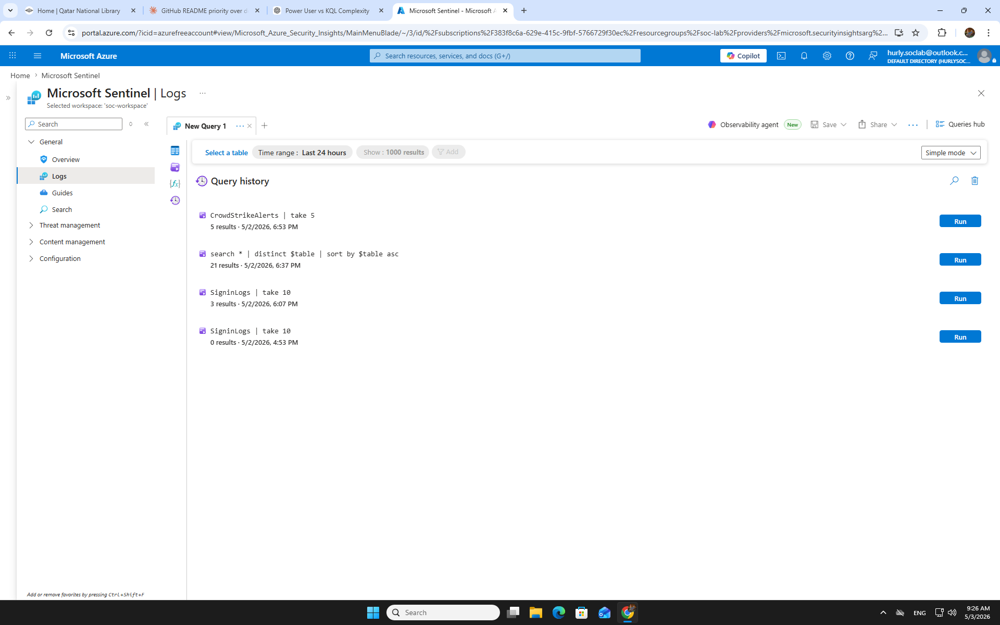
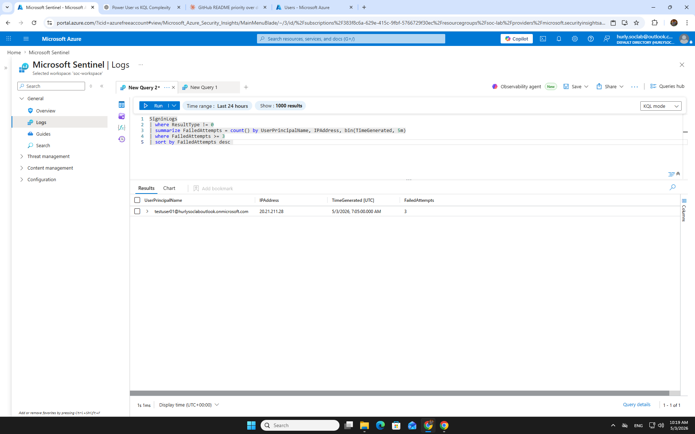
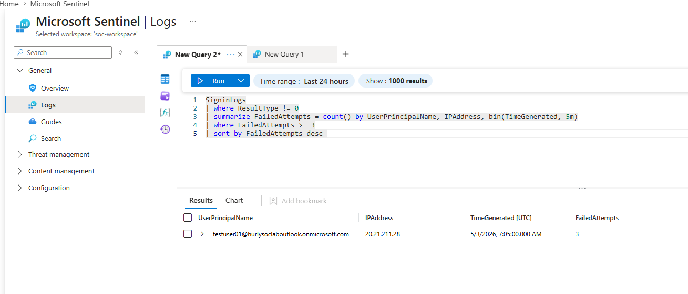
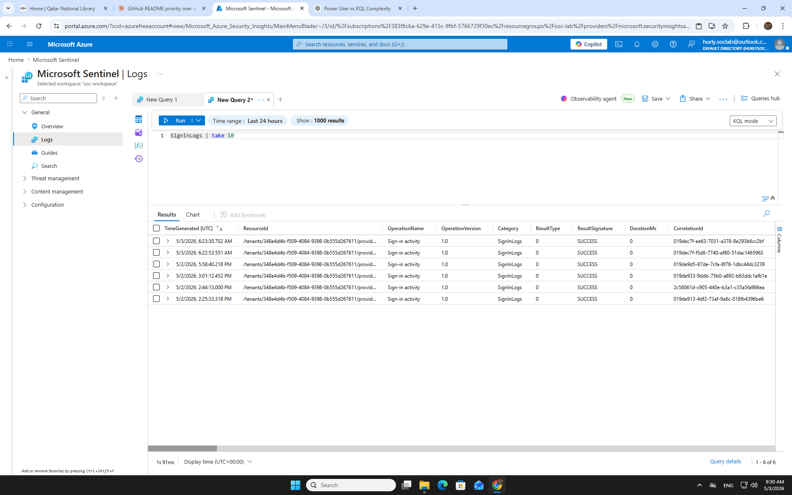

# SC01 — Brute Force Login Investigation
**Severity:** High | **Status:** Closed — True Positive | **Platform:** Microsoft Sentinel + Defender XDR

---

## S1 — Alert Summary & Severity Rubric

| Field | Detail |
|---|---|
| Alert Name | Multiple Failed Sign-In Attempts |
| Data Source | SigninLogs |
| Trigger | Threshold rule — repeated failed logins from single IP |
| Affected Account | Targeted user UPN |
| Source IP | Suspicious external IP |
| Timeframe | Within 10-minute window |

**Severity Rubric:**

| Factor | Assessment |
|---|---|
| Volume of failures | High — multiple attempts in short window |
| Successful login after failures? | Investigated (see S2) |
| Known IP / TI match | Checked against ThreatIntelligenceIndicator |
| Blast radius | Single account — contained |

---

## S2 — 🔵 SC-200 Detection: Sentinel + Defender XDR

### Step 1 — Initial Query: Sign-In History

Pull recent sign-in history for the targeted account to establish baseline before the alert window.

```kql
SigninLogs
| where TimeGenerated > ago(24h)
| where UserPrincipalName == "<targeted_user>"
| project TimeGenerated, UserPrincipalName, IPAddress, ResultType, ResultDescription, Location
| sort by TimeGenerated desc
```

**WHY:** Establish normal pattern before isolating the anomaly window.
**WHAT:** Returns all sign-in attempts (success + failure) for the account.
**LIMITATION:** SigninLogs only covers Azure AD authentications — on-prem logins not visible here.



---

### Step 2 — Detection Query: Failed Login Spike

Isolate the brute force window — look for repeated ResultType failures (50126 = invalid credentials).

```kql
SigninLogs
| where TimeGenerated > ago(1h)
| where ResultType == "50126"
| where UserPrincipalName == "<targeted_user>"
| summarize FailureCount = count() by IPAddress, UserPrincipalName, bin(TimeGenerated, 5m)
| sort by FailureCount desc
```

**WHY:** Confirm whether failures are clustered (brute force pattern) vs scattered (user error).
**WHAT:** Groups failures by IP in 5-minute bins — spike = automated attack.
**LIMITATION:** Single ResultType filter — password spray uses distributed IPs, needs broader query.





---

### Step 3 — FP Branch: Check for Successful Login After Failures

Critical step — did the attacker succeed? This determines TP escalation vs FP closure.

```kql
SigninLogs
| where TimeGenerated > ago(1h)
| where UserPrincipalName == "<targeted_user>"
| where ResultType == "0"
| project TimeGenerated, IPAddress, Location, UserAgent
| sort by TimeGenerated desc
```

**WHY:** A successful login (ResultType 0) following failure spike = account compromise.
**WHAT:** Returns only successful authentications — cross-reference IP against failure source.
**LIMITATION:** Absence of result here does not confirm safety — attacker may have paused.




---

### TP / FP Decision

| Signal | Finding |
|---|---|
| Failure spike confirmed | ✅ Yes — clustered within 10-minute window |
| Successful login after spike | ❌ No — ResultType 0 not found from attacker IP |
| IP matches known TI | Checked — flag if match found |
| **Verdict** | **True Positive — Brute Force attempt, account not compromised** |

**Escalation:** Escalate to Tier 2 with caveat — attack blocked but IP should be blocked and account reviewed for MFA enforcement.

---

### Control Failure Identified

MFA was **not enforced** on the targeted account — brute force was only stopped by account lockout policy, not a security control. This is the root gap.

---

### Closure Criteria

- [ ] Attacker IP blocked at Conditional Access or firewall
- [ ] MFA enforced on targeted account
- [ ] Account reviewed — no lateral movement indicators
- [ ] Incident closed in Sentinel with TP classification

---

## S3 — MITRE ATT&CK Mapping

| Tactic | Technique | ID |
|---|---|---|
| Credential Access | Brute Force: Password Guessing | T1110.001 |
| Initial Access | Valid Accounts (if login succeeded) | T1078 |
| Defense Evasion | Use of valid-looking credentials to blend | — |

---

## S4 — Mitigation

| Action | Owner | Priority |
|---|---|---|
| Block source IP in Conditional Access | Identity/IAM team | Immediate |
| Enforce MFA on all accounts — no exceptions | IAM team | High |
| Enable Identity Protection risk policy | Azure AD admin | High |
| Set account lockout threshold review | IAM team | Medium |
| Alert tuning — lower threshold for failure spike | SOC / Sentinel admin | Medium |

---

## S5 — 🟠 AZ-500 Hardening (THEORETICAL — Hands-on Month 2–3)

> ⚠️ All items below are theoretical based on AZ-500 study. Not yet validated in live lab environment.

### D1 — Identity & Access Hardening

- **Conditional Access Policy:** Block sign-ins from high-risk locations + enforce MFA for all users.
- **Identity Protection:** Enable sign-in risk policy set to "Block" at High risk level.
- **Named Locations:** Define trusted IP ranges — flag anything outside as risky.

### D2 — Network Controls

- **Tenant Restrictions:** Limit which external tenants can authenticate.
- **Private Endpoints:** Reduce publicly exposed authentication surfaces where possible.

### D3 — Compute / Resource Controls

- Not primary attack surface for brute force — N/A for this scenario.

### D4 — Security Operations

- **Sentinel Analytics Rule:** Custom rule for 10+ failures from single IP within 5 minutes.
- **Playbook (Logic App):** Auto-disable account on confirmed brute force pattern pending human review.
- **Automation vs Playbook distinction:** Automation rules triage and assign — Playbooks execute response actions (account disable, IP block notification).

---

## S6 — Lessons Learned & Interview Q&A

### Lessons Learned

1. **MFA gap was the real finding** — the brute force itself was noisy and detectable; what matters is whether the control layer held.
2. **Absence of successful login ≠ safe** — attacker could resume. Containment must happen regardless.
3. **ResultType codes matter** — knowing 50126 vs 0 vs 50074 is the difference between a fast triage and a slow one.

---

### Interview Q&A

**Q: You get a brute force alert — what's the first thing you check?**
> Whether there was a successful login after the failure spike. That's the TP/FP pivot point. Failed attempts alone may be noise — a successful login after them is a compromise.

**Q: How do you tell brute force from password spray?**
> Brute force = many failures against one account from one IP. Password spray = one or few failures across many accounts from distributed IPs. Different query approach — spray needs account-side grouping, not IP-side.

**Q: Alert fired, no successful login found — do you close it?**
> No — I escalate as TP with caveat. Attack was real, control failure (no MFA) was real. IP gets blocked, MFA gets enforced. Closure only after containment confirmed.

**Q: What's the control failure in this scenario?**
> MFA not enforced. The only thing that stopped the attacker was lockout policy — not a proactive security control. That gap needs to be closed before this case is truly resolved.

---

*Portfolio case — SC01 | Microsoft Sentinel Training Lab | Hurly Cabalan*
