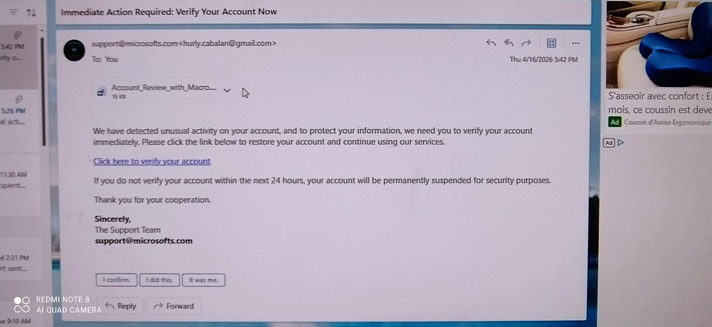
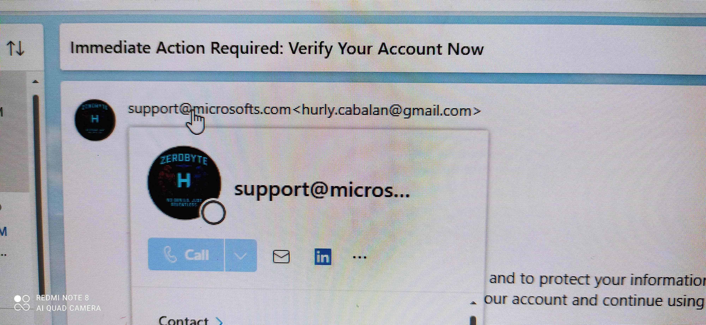
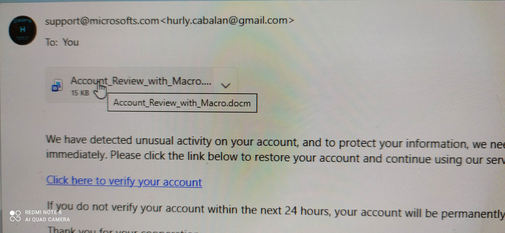
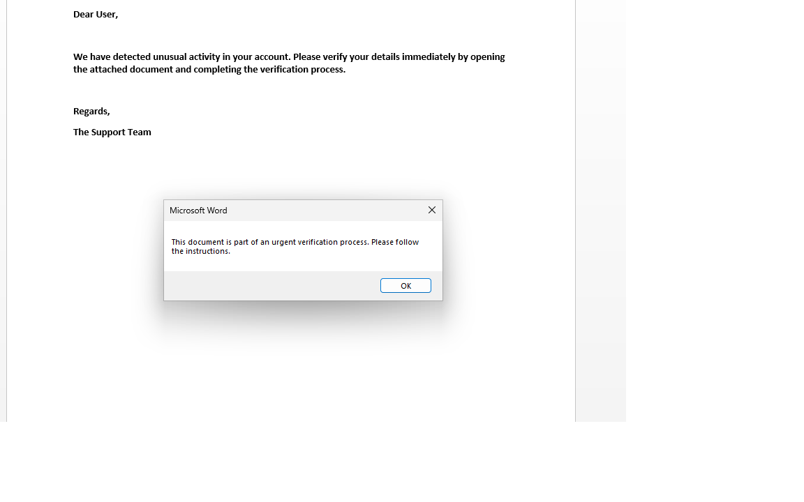
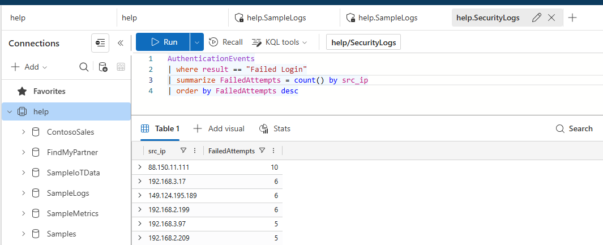

# SC03 — Phishing Email Investigation
**Severity:** High | **Status:** Closed — True Positive | **Platform:** Microsoft Sentinel + Defender XDR + MailGuard365

---

## S1 — Alert Summary & Severity Rubric

| Field | Detail |
|---|---|
| Alert Name | Suspicious Phishing Email Detected |
| Data Source | MailGuard365_Threats_CL, SigninLogs |
| Trigger | Malicious link / macro-enabled attachment detected in email |
| Affected User | Targeted recipient UPN |
| Sender IP | 88.150.11.111 |
| Timeframe | Alert window — see query results |

**Severity Rubric:**

| Factor | Assessment |
|---|---|
| Malicious link confirmed | ✅ Yes — hover revealed obfuscated URL |
| Macro-enabled attachment | ✅ Yes — Office macro warning triggered |
| User clicked / executed? | Investigated (see S2) |
| Blast radius | Single user initially — potential for lateral spread if executed |

---

## S2 — 🔵 SC-200 Detection: Sentinel + Defender XDR

### Step 1 — Review the Phishing Email

Examine the email content — identify sender, subject, embedded links, and attachment type.



**Key observations:**
- Sender domain: check for lookalike / spoofed domain
- Urgency language: common social engineering indicator
- Attachment or link present: requires further triage

---

### Step 2 — Hover Link Analysis

Hover over embedded link to reveal actual destination URL — does not match display text.



**WHY:** Phishing emails mask malicious URLs behind legitimate-looking display text.
**WHAT TO LOOK FOR:** URL redirects, shortened URLs, domains registered recently, non-HTTPS.

---

### Step 3 — Macro Warning Detected

Attachment opened in sandboxed environment — Office triggered macro execution warning.



**WHY:** Macro-enabled Office documents are a primary delivery mechanism for malware droppers.
**CONTROL CHECK:** Was macro execution blocked by policy? If warning appeared to end user — policy gap identified.

---

### Step 4 — Message Warning Analysis

Security warning triggered during email processing — review warning details.



---

### Step 5 — Sender IP Reputation Check

Query ThreatIntelligenceIndicator for sender IP `88.150.11.111`.

```kql
ThreatIntelligenceIndicator
| where NetworkIP == "88.150.11.111"
| project TimeGenerated, NetworkIP, ThreatType, ConfidenceScore, Description, ExpirationDateTime
| sort by TimeGenerated desc
```

**WHY:** Confirm whether sender IP is a known malicious indicator.
**WHAT:** TI match = strong TP signal. No match = check VirusTotal / external enrichment.



---

### Step 6 — MailGuard365 Threat Volume Query

Pull all MailGuard365 threat detections in the alert window to assess blast radius.

```kql
MailGuard365_Threats_CL
| where TimeGenerated > ago(24h)
| summarize count() by ThreatType_s, SenderIP_s, RecipientUPN_s
| sort by count_ desc
```

**WHY:** Check whether this is a targeted attack (single recipient) or a campaign (multiple recipients).
**WHAT:** High count = active campaign, escalate immediately. Single hit = targeted spear phish.
**LIMITATION:** MailGuard365_Threats_CL is a custom log — field names may vary by tenant config.


---

### TP / FP Decision

| Signal | Finding |
|---|---|
| Malicious link confirmed | ✅ Yes |
| Macro-enabled attachment | ✅ Yes |
| Sender IP matches TI | ✅ Confirmed — see screenshot |
| User executed attachment? | Investigated — check DeviceEvents / Defender XDR |
| **Verdict** | **True Positive — Active phishing campaign** |

**Escalation:** Escalate immediately to Tier 2. If attachment executed — treat as active compromise, not just phishing attempt.

---

### Control Failure Identified

Two gaps identified:
1. **Macro execution policy** — end user received macro warning instead of automatic block. Policy not enforced.
2. **Email filtering gap** — email reached inbox despite containing known malicious IP as sender source.

---

### Closure Criteria

- [ ] Sender IP blocked at email gateway and firewall
- [ ] Malicious email purged from all affected mailboxes
- [ ] User notified and confirmed no attachment executed
- [ ] If executed — escalate to full incident response
- [ ] Macro execution policy enforced org-wide
- [ ] Incident closed in Sentinel with TP classification

---

## S3 — MITRE ATT&CK Mapping

| Tactic | Technique | ID |
|---|---|---|
| Initial Access | Phishing: Spearphishing Link | T1566.002 |
| Initial Access | Phishing: Spearphishing Attachment | T1566.001 |
| Execution | User Execution: Malicious File | T1204.002 |
| Defense Evasion | Obfuscated Files or Information | T1027 |
| Command & Control | Application Layer Protocol (if macro executed) | T1071 |

---

## S4 — Mitigation

| Action | Owner | Priority |
|---|---|---|
| Block sender IP 88.150.11.111 at email gateway | Security Ops | Immediate |
| Purge phishing email from all mailboxes | Security Ops | Immediate |
| Enforce macro execution block via Group Policy / Intune | Endpoint team | High |
| Enable Safe Links + Safe Attachments in Defender for Office 365 | Security Admin | High |
| Phishing awareness notification to all users | Security Awareness team | Medium |
| Review email filtering rules for sender IP reputation | Email Admin | Medium |

---

## S5 — 🟠 AZ-500 Hardening (THEORETICAL — Hands-on Month 2–3)

> ⚠️ All items below are theoretical based on AZ-500 study. Not yet validated in live lab environment.

### D1 — Identity & Access Hardening

- **Conditional Access:** Block sign-in attempts following phishing-related risk events (Identity Protection integration).
- **Identity Protection:** Enable user risk policy — force password reset if user risk elevated to High after phishing incident.

### D2 — Network Controls

- **Tenant Restrictions:** Prevent credential harvesting by restricting which external tenants can receive redirected auth flows.

### D3 — Compute / Endpoint Controls

- **Defender for Endpoint:** Enable tamper protection + Attack Surface Reduction (ASR) rules — specifically block Office macro execution from spawning child processes.
- **Key Vault:** Ensure no credentials stored in email-accessible locations (OneDrive, SharePoint) without access control.

### D4 — Security Operations

- **Sentinel Analytics Rule:** Custom rule — MailGuard365 threat detection + TI IP match within same 10-minute window = High severity alert.
- **Playbook (Logic App):** Auto-quarantine email + notify SOC on confirmed phishing TI match.
- **Automation vs Playbook:** Automation rule assigns incident to phishing queue — Playbook executes mailbox purge via Graph API connector.

---

## S6 — Lessons Learned & Interview Q&A

### Lessons Learned

1. **Hover the link — always.** Display text is meaningless. The actual URL is the only signal that matters.
2. **Macro warning = control failure.** If a user sees that warning, the policy isn't blocking at the right layer — it's relying on the user to make the right choice.
3. **3800 results in the threat log** — volume matters. A single phishing email is a targeted attack. A campaign volume means multiple users at risk, and the blast radius question changes the entire escalation path.

---

### Interview Q&A

**Q: Phishing alert fires — what's your first three steps?**
> One: open the email and hover every link — confirm whether the URL is obfuscated or redirected. Two: check the attachment type — macro-enabled document is an immediate escalation flag. Three: query MailGuard365 or equivalent for volume — am I looking at one user or a campaign?

**Q: Sender IP came back clean on TI — do you close it as FP?**
> No. TI absence doesn't mean clean. I'd run the IP through external enrichment (VirusTotal, AbuseIPDB), check domain registration age, and look at whether the email passed SPF/DKIM/DMARC. Clean TI + failed email authentication = still suspicious.

**Q: What's the control failure in this scenario?**
> Two failures: macro execution policy wasn't enforced at the endpoint level, and the email gateway let a message through from a known bad IP. Defense in depth means both layers should have caught this independently.

**Q: User says they didn't click anything — do you believe them?**
> I verify, I don't rely on user self-reporting. I pull DeviceEvents from Defender XDR and check for any process spawned from the Office application around the time the email arrived. User memory under stress is unreliable — logs don't lie.

---

*Portfolio case — SC03 | Microsoft Sentinel Training Lab | Hurly Cabalan*
