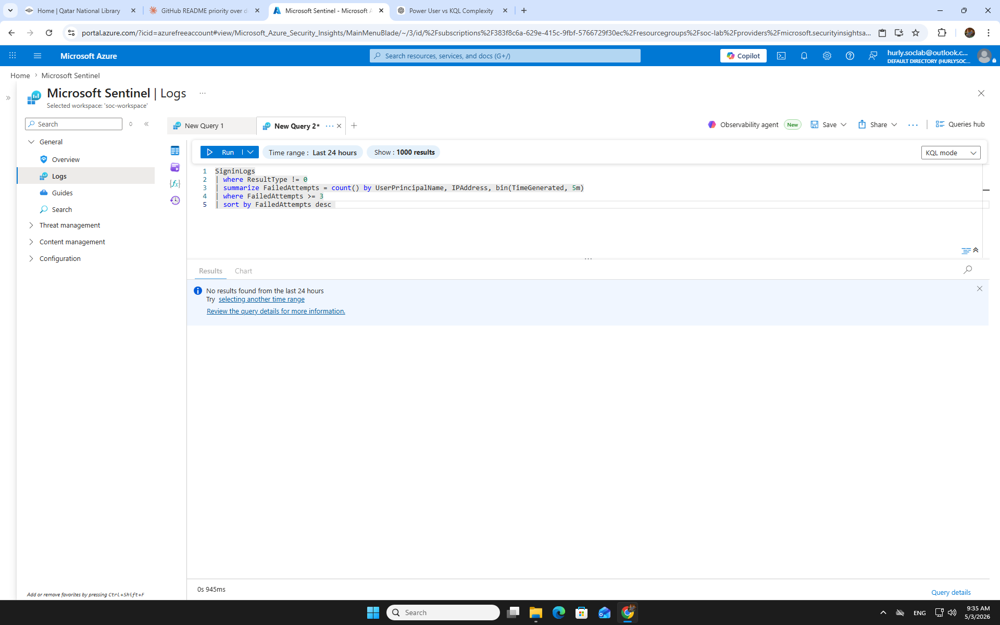

# Scenario 01 — Brute Force Attack

**Analyst:** Hurly Cabalan
**Date Executed:** 2026-05-03
**Platform:** Microsoft Sentinel / Microsoft Entra ID / Outlook Web
**Severity:** HIGH
**Status:** ✅ COMPLETED

---

## Alert

9 failed logins from a single IP (`20.21.211.28`) targeting `testuser01@hurlysoclab.onmicrosoft.com` via Outlook Web over a **31-minute window** (06:54 – 07:25 UTC).

| Field | Detail |
|-------|--------|
| Error Code | `50055` (expired password) → `50126` (wrong password) |
| Failed Attempts | 9 across 31-minute window |
| Source IP | `20.21.211.28` |
| Location | Ad Dawhah, QA |
| Application | Outlook Web |
| Authentication Type | Single-factor (no MFA enrolled) |
| Breach | ✅ YES — successful login at 06:56 UTC |

> Low-and-slow pattern — spaced attempts over 31 minutes designed to evade velocity-based detection thresholds.

---

## Hypothesis

Brute force attack — credential stuffing attempt using a low-and-slow technique targeting webmail access. Attacker deliberately paced attempts to stay below a >=10 failure threshold, suggesting awareness of standard detection rules.

---

## Investigation

### KQL Queries Run

| Step | Query | Result |
|------|-------|--------|
| 1 | Failed logins check | 9 failures, 1 account, 1 IP |
| 2 | Detection threshold >=10 | ❌ Empty — attack missed |
| 3 | Detection threshold >=5 | ✅ testuser01 detected |
| 4 | Success after failures (TP check) | 4 successful logins confirmed |
| 5 | AuditLogs post-compromise | Empty — no directory changes |
| 6 | IP enrichment | Single IP, Ad Dawhah QA, multi-account |

### Raw Sign-In Log Data

| Time (UTC) | User | Application | Status | Error Code | IP Address |
|------------|------|-------------|--------|------------|------------|
| 06:54 | testuser01 | Outlook Web | Failure | 50055 | 20.21.211.28 |
| 06:56 | testuser01 | Outlook Web | **Success** | 0 | 20.21.211.28 |
| 06:57 | testuser01 | Outlook Web | Success | 0 | 20.21.211.28 |
| 07:01 | testuser01 | Outlook Web | Success | 0 | 20.21.211.28 |
| 07:08 | testuser01 | Outlook Web | Failure | 50126 | 20.21.211.28 |
| 07:10 | testuser01 | Outlook Web | Failure | 50126 | 20.21.211.28 |
| 07:25 | testuser01 | Outlook Web | Failure | 50126 | 20.21.211.28 |

> Breach occurred within 2 minutes of first attempt. Attacker gained Outlook Web access — email contents exposed. No privilege escalation or directory changes confirmed via AuditLogs.

### Investigation Narrative

**Step 1 — Validate user and authentication details:**
Pulled SigninLogs from Sentinel filtered by `testuser01` and status `Failure`. All failed attempts originated from `20.21.211.28` with no IP rotation or proxy behavior observed.

**Step 2 — Analyze log pattern:**
Mixed error codes — `50055` (expired password) followed by `50126` (wrong password) — indicates the attacker first attempted expired credentials before switching to active ones. Attempts were spaced across 31 minutes, consistent with a slow credential stuffing tool, not a human user.

**Step 3 — Confirm breach:**
Step 4 of the KQL investigation confirmed 4 successful logins after the failures. This is the critical check — failures alone are incomplete. Always validate whether any success followed the failure chain.

**Step 4 — Check for lateral movement:**
AuditLogs post-compromise returned empty — no group membership changes, no role assignments, no application grants. Breach was limited to email access. No password spray pattern against other accounts confirmed.

### Screenshots

---

## Attack Timeline

| Time (UTC) | Event |
|------------|-------|
| 06:54 | First failure — expired password (50055) |
| 06:56 | ✅ BREACH — successful login |
| 06:57 | ✅ Continued access |
| 07:01 | ✅ Continued access |
| 07:08–07:10 | 4 more failures (50126) |
| 07:25 | Last failure — attack ends |

---

## TP/FP Decision

**TRUE POSITIVE — Escalate immediately**

Evidence confidence: **STRONG**

- Multi-signal: failures + success + same IP + same user ✅
- Breach confirmed within 2 minutes of first attempt ✅
- Post-breach email access risk (Outlook Web) ✅
- No MFA enrolled on account ✅
- No directory changes — contained to email tier ✅

---

## Detection Gap

Default Sentinel threshold (`>=10 failures`) **missed this attack entirely.**

9 failures was sufficient to compromise the account. The low-and-slow technique exploited a poorly tuned detection rule — the attacker never triggered the threshold.

**Fix:** Lower threshold to `>=5` failures with a time-window filter (e.g., within 10 minutes) to reduce false positive noise while catching sub-threshold attacks.

---

## FP Stress Case

Same source IP (`20.21.211.28`) hit both `testuser01` and admin account `hurly.soclab`. Pattern mimics lateral movement but was an analyst test session.

**Lesson:** Always cross-reference the source IP against known-good analyst IPs before escalating. Detection alone cannot distinguish admin testing from real lateral movement — process context is required. Maintain a documented analyst IP allowlist.

---

## Mitigation

**Immediate response:**

- Disable `testuser01` account immediately
- Block IP `20.21.211.28` at Conditional Access level
- Force password reset on `testuser01`
- Review Outlook Web session logs for data exfiltration indicators
- Continue monitoring for resumed attempts from new IPs (48-hour window)

**Detection fix:**

- Lower Sentinel alert threshold to `>=5`
- Add time-window filter: 5+ failures within 10 minutes

---

## Automation vs. Human Boundary

| Action | Owner |
|--------|-------|
| Disable account | Automate (Logic App) |
| Block IP | Automate (Sentinel playbook) |
| Notify SOC | Automate |
| TP/FP decision | Human |
| Escalation severity | Human |
| Legal / HR notification | Human |

---

## Hardening

- **Enforce MFA on all accounts** — this attack succeeded only because MFA was absent. A credential match alone would not have completed the breach if MFA was enabled.
- **Enable rate-limiting** on login attempts before lockout threshold is reached.
- **Increase password complexity** requirements.
- **Apply Conditional Access geofencing** — restrict logins to pre-approved regions.
- **Enable Entra ID Smart Lockout** — automate lockout rather than relying on manual response.
- **Enable behavioral analytics** (Identity Protection) to flag anomalous login velocity and unfamiliar device signals.

---

## Compliance

| Framework | Control |
|-----------|---------|
| **QCSF** | Access control failure — identity protection control gap |
| **NIST** | PR.AC-1 (identities managed), DE.CM-1 (network monitored) |
| **ISO 27001** | A.9.4.2 (secure log-on procedures) |

---

## Escalation Path

**Escalate to:** SOC L2 / Incident Response
**Escalation trigger:** Confirmed breach — successful authentication post-failure chain, email access confirmed, no MFA enrolled

**Escalation note:** Breach confirmed. Attacker accessed Outlook Web. Account disabled and IP blocked. No lateral movement or privilege escalation detected. Recommend L2 review email logs for data exfiltration and confirm scope before closing.

---

## Lessons Learned

1. **Low failure count ≠ low risk.** 9 failures breached the account. Threshold tuning is a detection engineering decision, not a default setting.
2. **Always check for success after failures.** That is the real question — not how many times they tried, but did they get in.
3. **Lab contamination is real.** Analyst IP hitting multiple accounts creates false lateral movement signals. Document known-good analyst IPs before running tests.
4. **Lockout threshold too permissive.** Even a >=5 threshold would catch this. For privileged accounts, 3 failures should trigger review.
5. **MFA is the last line.** When Conditional Access and thresholds both fail, MFA stops the breach. Its absence here allowed full compromise.

### Problems Encountered During Investigation

- Initial alert showed attempt count but not granular timestamps — had to pull raw SigninLogs separately to confirm the attack window. **Lesson:** Always go to raw logs, not just the alert summary.
- Distinguishing brute force from a forgotten password required velocity analysis. 31 minutes with mixed error codes is not human behavior.
- FP stress case: analyst IP created a lateral movement false signal. Required manual cross-reference to resolve.

---

## Interview Q&A

**Q: How did you determine this was a TP and not a user forgetting their password?**
A: Three signals. First, velocity — 9 attempts over 31 minutes with mixed error codes is not human behavior. Second, the attacker succeeded, which a genuinely locked-out user would not. Third, the post-breach AuditLogs were clean — no password reset request, no helpdesk ticket, no legitimate user activity pattern.

**Q: What would you do differently in the detection rule?**
A: Lower the threshold from >=10 to >=5 and add a time-window filter. The default >=10 rule missed this attack entirely. Detection engineering is not set-and-forget — threshold tuning based on real incident data is part of the SOC's job.

**Q: Why didn't you escalate immediately when you saw the failures?**
A: Failures alone are weak signal. The escalation decision was made when Step 4 confirmed successful logins after the failure chain. That changed the confidence from Medium to Strong and the action from monitor to escalate.

---

*Part of the [SOC Investigation Portfolio](../README.md) — SC-Series: SC-200 exam signal*
