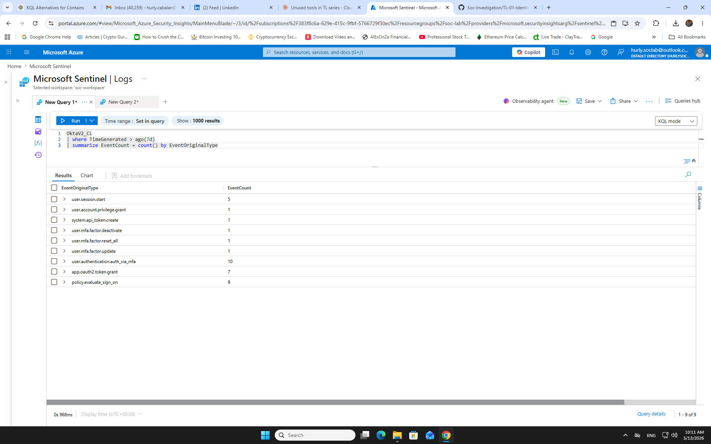
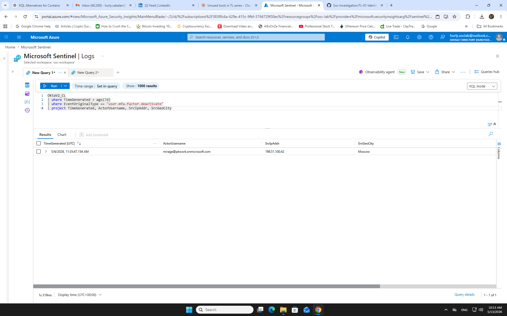
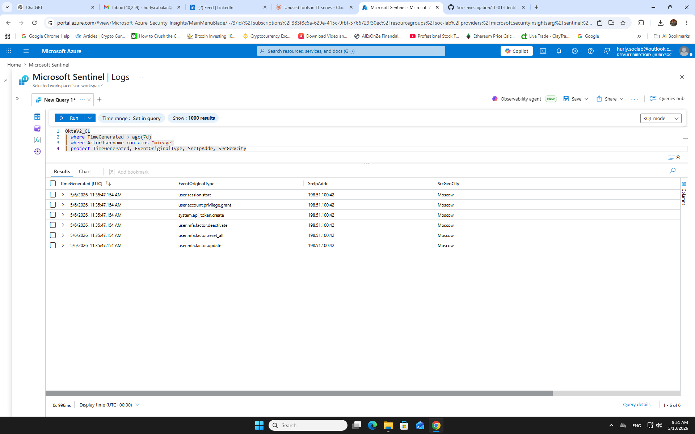
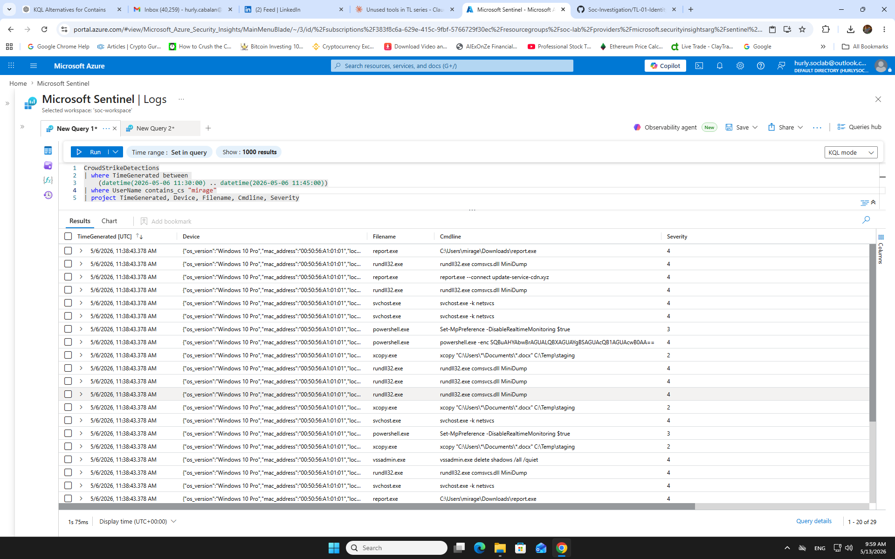
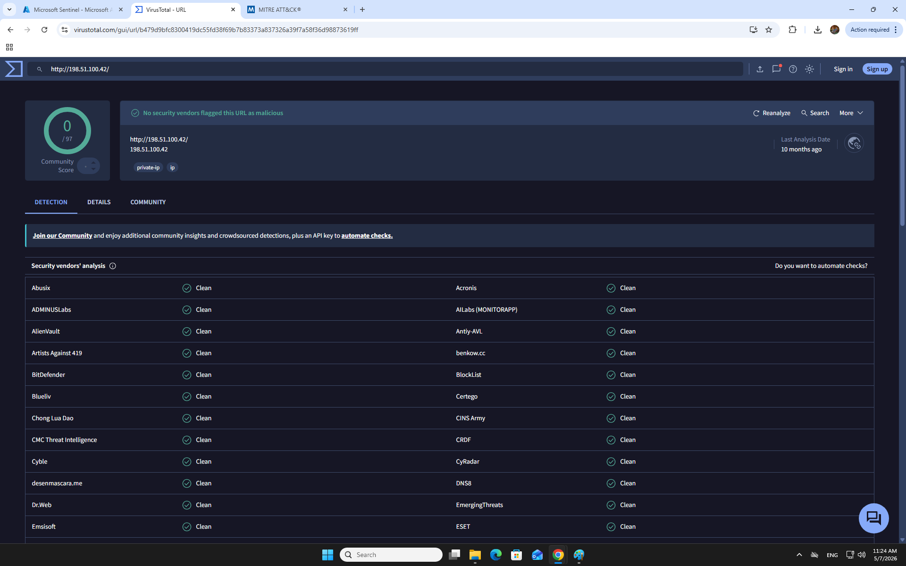
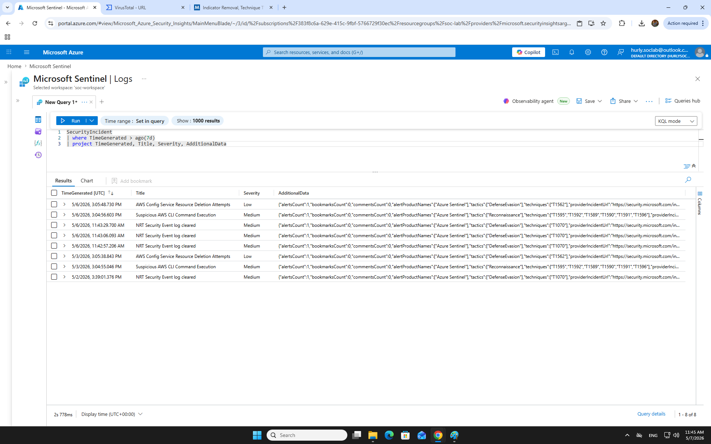
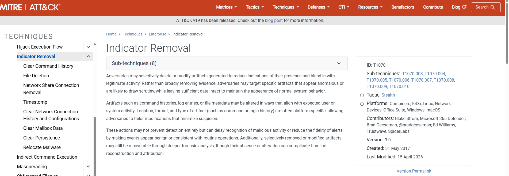
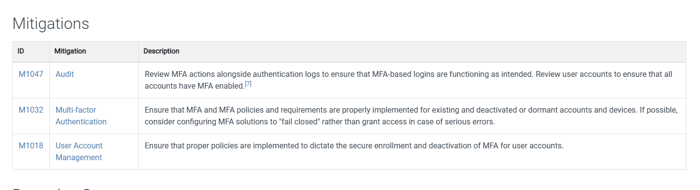
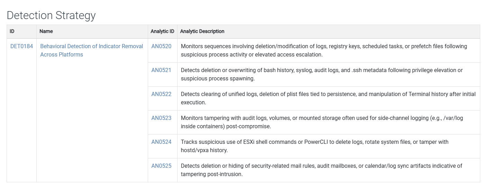
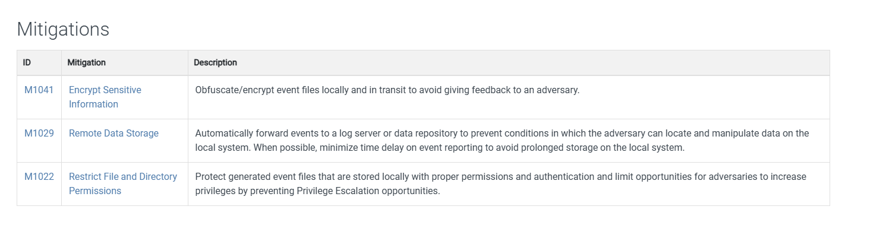

# TL-01 — Identity-Driven Investigation
**Threat Lab | Identity-First Pivot: Okta → CrowdStrike**

---

## S1 — Alert Summary

| Field | Details |
|---|---|
| **Case ID** | TL-01 |
| **Date** | May 7, 2026 |
| **Severity** | 🔴 Critical |
| **Actor** | User `mirage` — mirage@pkwork.onmicrosoft.com |
| **Source IP** | 198.51.100.42 (Moscow, Russia) |
| **Initial Signal** | OktaV2_CL — MFA deactivation from anomalous geolocation |
| **Verdict** | ✅ True Positive — Escalate to L2 immediately |

### Severity Rubric
| Factor | Score | Reason |
|---|---|---|
| **Impact** | Critical | Super admin granted + MFA wiped + endpoint fully compromised |
| **Confidence** | High | Multi-vendor corroboration: Okta + CrowdStrike + SecurityIncident |
| **Scope** | Critical | Full Okta tenant + endpoint compromise + credentials dumped |
| **Business Criticality** | Critical | Identity provider takeover + endpoint = attacker owns everything |

### Attack Timeline

| Time | Event | Significance |
|---|---|---|
| 11:35:47 | `user.session.start` | Attacker authenticated using valid mirage credentials |
| 11:35:47 | `user.account.privilege.grant` | Super admin escalation — immediate |
| 11:35:47 | `system.api_token.create` | Persistence token created |
| 11:35:47 | `user.mfa.factor.deactivate` | MFA removed from mirage account |
| 11:35:47 | `user.mfa.factor.reset_all` | All MFA wiped across tenant |
| 11:35:47 | `user.mfa.factor.update` | Attacker-controlled MFA enrolled |
| 11:38:43 | `report.exe` execution | C2 callback to update-service-cdn.xyz |
| 11:38:43 | `Set-MpPreference -DisableRealtimeMonitoring $true` | Defender disabled |
| 11:38:43 | `rundll32.exe comsvcs.dll MiniDump` | LSASS credential dumping |
| 11:38:43 | `vssadmin delete shadows /all /quiet` | Shadow copies deleted |
| 11:38:43 | `xcopy C:\Users\*\Documents\*.docx C:\Temp\staging` | Data staged for exfil |
| 11:42:00 | NRT Security Event log cleared | Attacker covering tracks — T1070 confirmed |

### What Happened (3-Sentence Story)
Attacker authenticated into Okta as `mirage@pkwork.onmicrosoft.com` from Moscow (198.51.100.42) using stolen credentials and within the same second executed a fully scripted account takeover — escalating to super admin, creating a persistent API token, and wiping all MFA. Three minutes later at 11:38, CrowdStrike detected 29 endpoint events on mirage's device: `report.exe` called back to a C2 server, Defender was disabled, LSASS was dumped for credential harvesting, shadow copies were deleted, and documents were staged for exfiltration. The attack was simultaneous across identity (Okta) and endpoint (CrowdStrike) layers — confirming a coordinated, automated compromise with active cover-up via log clearing at 11:42.

> **Note:** IP 198.51.100.42 uses RFC 5737 documentation range for safe public sharing.

---

## S2 — 🔵 SC-200 | Sentinel + Defender XDR

### Investigation Queries (Chronological)

**Step 1 — Event Overview**
```kql
OktaV2_CL
| where TimeGenerated > ago(7d)
| summarize EventCount = count() by EventOriginalType
```
*Result: 6 distinct event types all linked to single mirage session.*



---

**Step 2 — MFA Deactivation Actor**
```kql
OktaV2_CL
| where TimeGenerated > ago(7d)
| where EventOriginalType == "user.mfa.factor.deactivate"
| project TimeGenerated, ActorUsername, SrcIpAddr, SrcGeoCity
```
*Result: mirage@pkwork.onmicrosoft.com — 198.51.100.42 — Moscow. Geolocation anomaly confirmed.*



---

**Step 3 — Full Actor Timeline**
```kql
OktaV2_CL
| where TimeGenerated > ago(7d)
| where ActorUsername contains "mirage"
| project TimeGenerated, EventOriginalType, SrcIpAddr, SrcGeoCity
```
*Result: All 6 attack events at 11:35:47 — same timestamp confirms scripted/automated execution.*



---

**Step 4 — CrowdStrike Endpoint Pivot**
```kql
CrowdStrikeDetections
| where TimeGenerated between 
    (datetime(2026-05-06 11:30:00) .. datetime(2026-05-06 11:45:00))
| where UserName contains_cs "mirage"
| project TimeGenerated, Device, Filename, Cmdline, Severity
```
*Result: 29 detections at 11:38:43 — 3 minutes after Okta attack. C2 callback, Defender disabled, LSASS dumped, shadow copies deleted, documents staged. Severity 4 (Critical) majority.*



---

**Step 5 — TI Lookup**

VirusTotal scan of 198.51.100.42 — 0/97 clean. RFC 5737 lab simulation IP. TP maintained on behavioral evidence.



---

**Step 6 — SecurityIncident Correlation**
```kql
SecurityIncident
| where TimeGenerated > ago(7d)
| project TimeGenerated, Title, Severity, AdditionalData
```
*Result: NRT Security Event log cleared at 11:42–11:43 AM — 7 minutes post-attack. T1070 confirmed in AdditionalData. Log clearing = attacker covering tracks.*



---

### FP Branch
> **What would make this benign?**
- IT admin performing scheduled Okta maintenance from VPN exit node resolving to Moscow
- report.exe is internal tool with known/whitelisted SHA256
- MFA reset part of approved account recovery workflow with change ticket

> **What log disproves malice?**
- Change ticket or CAB approval for MFA modifications at 11:35 UTC
- CrowdStrike showing report.exe with known/whitelisted hash
- Known VPN IP list confirming 198.51.100.42 as authorized exit node

> **Decision: Close or Escalate?**
- **Escalate immediately to L2.** No change ticket found. All 6 Okta events same second = scripted tool. 29 CrowdStrike detections 3 minutes later = coordinated attack. LSASS dump + shadow copy deletion + data staging + log clearing = active threat actor.

---

## S3 — MITRE ATT&CK Mapping

| Tactic | Technique | Evidence |
|---|---|---|
| Initial Access | T1078 — Valid Accounts | user.session.start from Moscow |
| Privilege Escalation | T1078.004 — Cloud Accounts | user.account.privilege.grant — super admin |
| Persistence | T1528 — Steal Application Access Token | system.api_token.create |
| Defense Evasion | T1556.006 — MFA Modification | user.mfa.factor.deactivate + reset_all |
| Persistence | T1098 — Account Manipulation | user.mfa.factor.update — attacker MFA enrolled |
| Execution | T1059.001 — PowerShell | powershell.exe -enc (base64 encoded) |
| Defense Evasion | T1562.001 — Impair Defenses | Set-MpPreference -DisableRealtimeMonitoring $true |
| Credential Access | T1003 — OS Credential Dumping | rundll32.exe comsvcs.dll MiniDump |
| Impact | T1490 — Inhibit System Recovery | vssadmin delete shadows /all /quiet |
| Collection | T1074 — Data Staged | xcopy Documents to C:\Temp\staging |
| Defense Evasion | T1070 — Indicator Removal | NRT Security Event log cleared 11:42 AM |











---

## S4 — Mitigation

### Immediate (0–1 hour)
- [ ] Disable `mirage@pkwork.onmicrosoft.com` Okta account
- [ ] Revoke all API tokens created during 11:35 UTC session
- [ ] Block IP 198.51.100.42 at firewall and Okta network zone
- [ ] Isolate mirage's endpoint via CrowdStrike RTR — network containment
- [ ] Force MFA re-enrollment for all affected accounts via secure out-of-band channel
- [ ] Revoke super admin role granted in this session
- [ ] Block `report.exe` SHA256 hash — add to CrowdStrike blocklist
- [ ] Block C2 domain `update-service-cdn.xyz` at DNS and firewall

### Short-term (24–72 hours)
- [ ] Force password reset for all domain accounts — LSASS scope unknown
- [ ] Audit all Okta privilege grants in last 30 days
- [ ] Review and revoke all unknown API tokens
- [ ] Investigate and recover staged documents from `C:\Temp\staging`
- [ ] Validate backup integrity — shadow copies deleted
- [ ] Review svchost.exe and rundll32.exe activity for lateral movement indicators

### Long-term
- [ ] Implement Conditional Access — block sign-ins from non-approved countries
- [ ] Enable PIM for Okta — require approval + MFA step-up for admin role activation
- [ ] Enable CrowdStrike prevention policy — block not just detect
- [ ] Enable LSA Protection and Credential Guard on all endpoints
- [ ] Enable Defender tamper protection — prevent PowerShell disabling AV

---

## Control Failure Analysis

| Layer | Control | Failure Mode |
|---|---|---|
| Identity | Okta MFA Policy | No geolocation restriction — Moscow login allowed without challenge |
| Identity | Okta RBAC | Super admin grantable without approval — no PIM in place |
| Identity | Okta MFA Management | MFA deactivation required no admin approval |
| Identity | API Token Policy | Token creation unrestricted — no approval workflow |
| Endpoint | CrowdStrike EDR | report.exe detected but not blocked — prevention policy not enforced |
| Endpoint | Windows Defender | Disabled via PowerShell — no tamper protection enabled |
| Endpoint | LSASS Protection | No LSA Protection — LSASS accessible to non-system processes |
| Detection | Sentinel Analytics | No alert fired on MFA deactivation — discovered via hunting not automation |

---

## S5 — 🟠 AZ-500 | D1–D4 Controls
⚠️ THEORETICAL — Hands-on Month 2–3

**D1 — Identity & Access**
- Entra ID Conditional Access: named locations policy — block or challenge non-approved countries
- PIM: just-in-time super admin activation — require approval + MFA step-up
- Identity Protection: risky sign-in policy — force step-up on medium/high risk score
- Enforce MFA re-authentication for all privileged Okta operations

**D2 — Secure Networking**
- Okta network zone: allowlist approved IP ranges, challenge all others
- Azure Firewall: block C2 domain `update-service-cdn.xyz` at DNS layer
- NSG outbound: restrict unknown destinations on non-standard ports

**D3 — Compute + Storage**
- Enable LSA Protection: `HKLM\SYSTEM\CurrentControlSet\Control\Lsa\RunAsPPL = 1`
- Enable Credential Guard on all domain-joined machines
- Enable CrowdStrike tamper protection — prevent Defender disabling via PowerShell
- Attack Surface Reduction rules: block credential stealing from LSASS

**D4 — Security Operations**
- Analytics rule: alert on `user.mfa.factor.deactivate` from non-approved network zone
- Analytics rule: alert on `user.account.privilege.grant` outside business hours
- Analytics rule: `dcount(EventOriginalType) > 4` from single actor within 60 seconds → Critical alert
- Playbook: auto-disable Okta account on CrowdStrike Critical detection
- Automation rule: isolate host on LSASS dump detection + notify L2 immediately

---

## Closure Criteria
- [x] Root cause identified — stolen credentials + scripted automated attack tooling
- [x] Blast radius mapped — Okta tenant, endpoint, LSASS credentials, staged documents
- [x] Containment actions defined — account disable, token revoke, endpoint isolation, IP block, C2 block
- [x] Ownership assigned — L2 escalation with full evidence package
- [x] Documentation complete — all queries, screenshots, MITRE mapping, control failures recorded

---

## S6 — Lessons Learned + Interview Q&A

### Biggest Lesson
**Identity signals open the door; endpoint signals reveal the full blast radius.** Okta alone showed super admin takeover. CrowdStrike showed a simultaneously compromised endpoint — LSASS dumped, Defender disabled, documents staged, logs cleared. One vendor = incomplete picture. Always pivot.

### What I Got Wrong
- **False assumption:** Initially expected CrowdStrike to return empty results — wrong column names (`CommandLine` vs `Cmdline`) caused empty results on first attempt. Schema check required before every new table
- **Failed query:** `ago(24h)` on Okta queries returned nothing — data was 7 days old, needed `ago(7d)`. Time range is always the first thing to check on empty results
- **Uncertainty moment:** T1070 log clearing 7 minutes post-attack — initially unclear if coincidence or attacker action. SecurityIncident correlation confirmed same timeframe. Timing proximity = strong circumstantial link

### Interview Q&A

**Q: How did you detect this attack?**
> Proactive hunting in OktaV2_CL — queried MFA deactivation events, identified Moscow anomaly, expanded to full actor timeline showing 6-event scripted takeover. Pivoted to CrowdStrike and found 29 endpoint detections 3 minutes later — C2, Defender disabled, LSASS dumped, data staged.

**Q: Why did all Okta events show the same timestamp?**
> Same-second execution across 6 event types = automated tooling. A human admin clicking through Okta would have seconds or minutes between actions. This behavioral pattern confirmed scripted attack and elevated Evidence Confidence to High.

**Q: You found 29 CrowdStrike detections — does that change the blast radius?**
> Significantly. Without the pivot, blast radius was Okta tenant only. With it — compromised endpoint, harvested LSASS credentials of unknown scope, disabled AV, deleted shadow copies, and staged documents ready for exfil. Full credential reset required, not just Okta remediation.

**Q: What controls failed here?**
> Eight controls failed across identity and endpoint layers. Key failures: no PIM for Okta admin grants, no MFA approval requirement for deactivation, CrowdStrike detect-only mode, no Defender tamper protection, no LSASS protection. Any single one working would have broken the chain.

**Q: What's the blast radius?**
> Confirmed: full Okta tenant compromise, mirage's endpoint fully owned, LSASS credentials harvested. Potential: all accounts stored in LSASS — domain-wide credential reset may be required. L2 forensics needed to confirm scope of data staged in `C:\Temp\staging`.

**Q: Why did T1070 appear 7 minutes after the Okta attack?**
> NRT Security Event log cleared at 11:42–11:43, 7 minutes post-attack. Consistent with attacker behavior — clear Windows event logs after establishing persistence and dumping credentials to reduce forensic visibility and delay detection. Timing correlation confirms same actor covering tracks.
