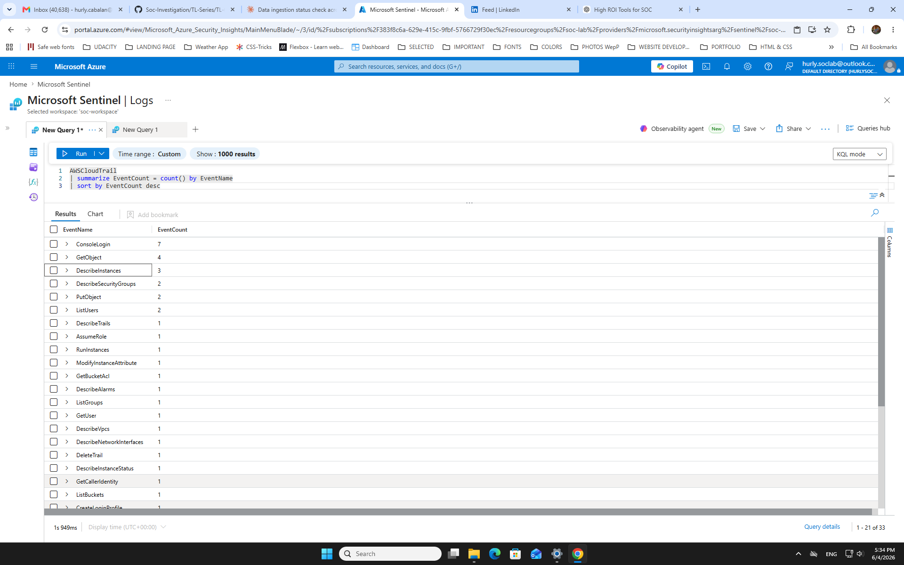
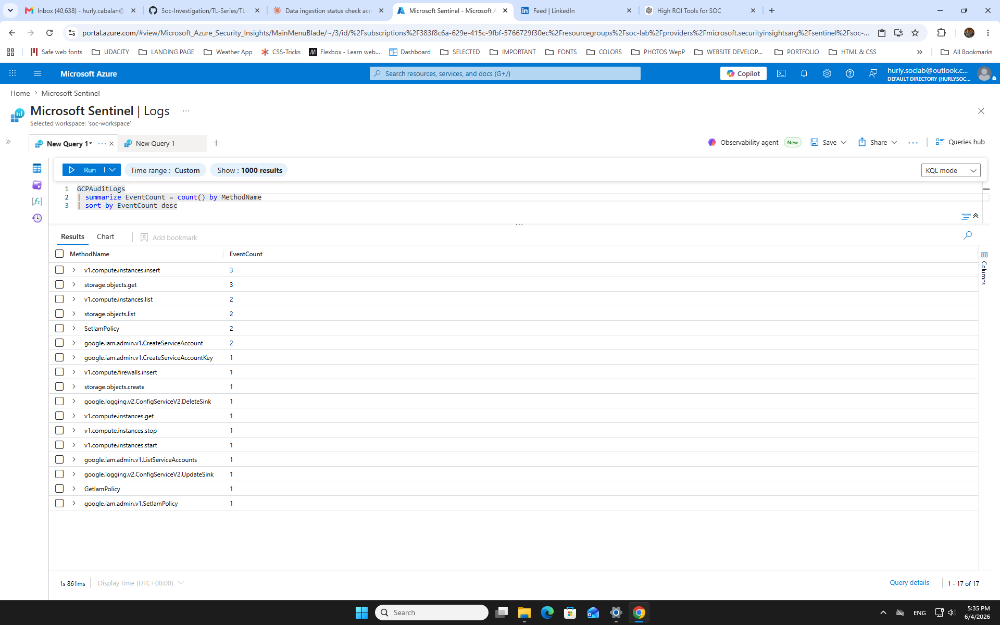
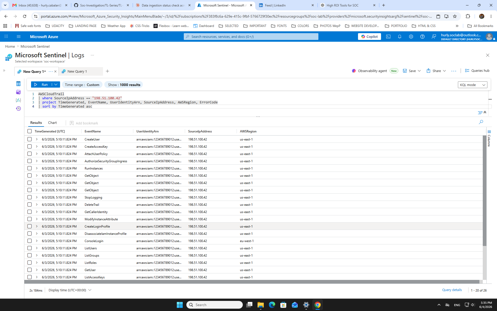
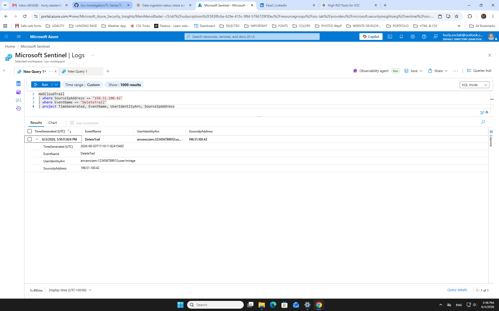
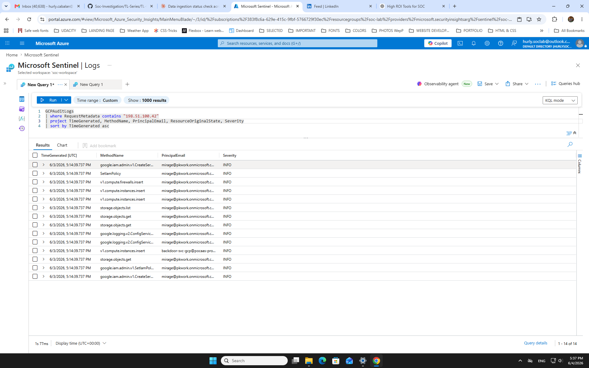
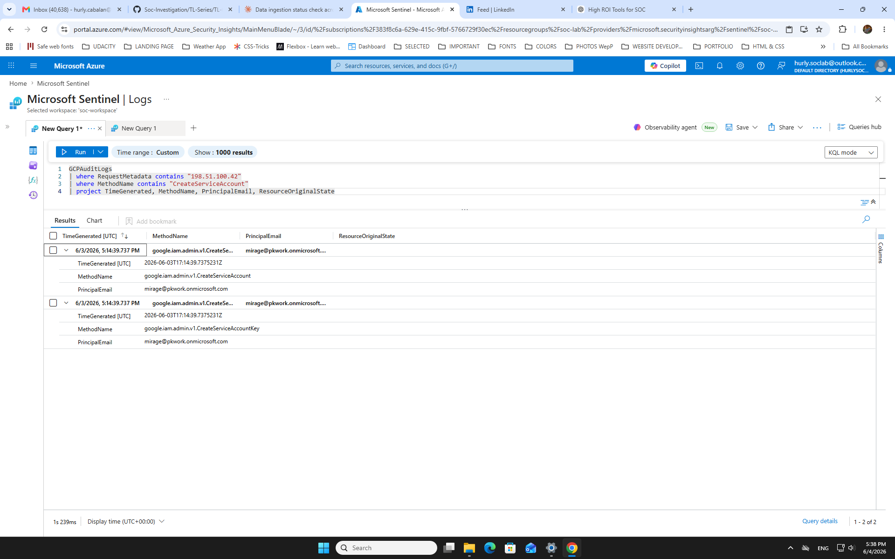
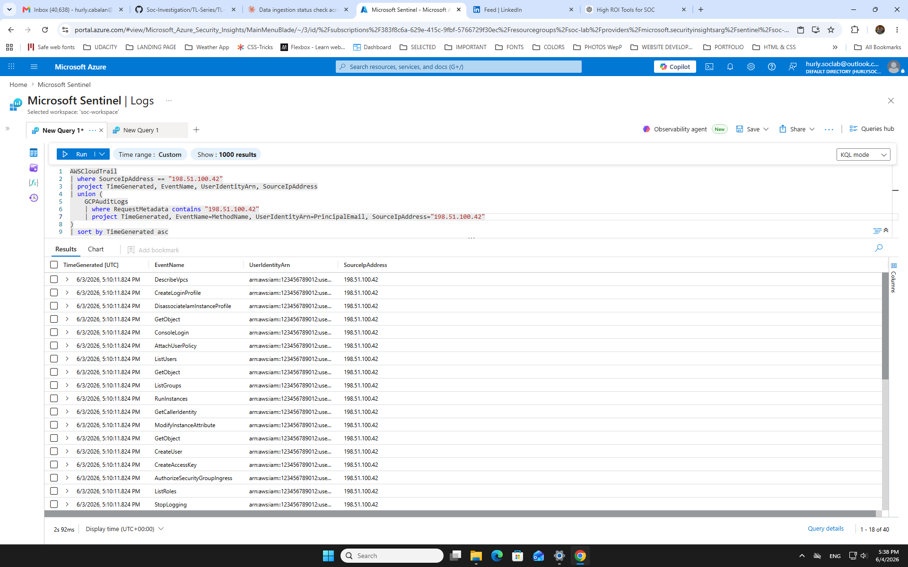
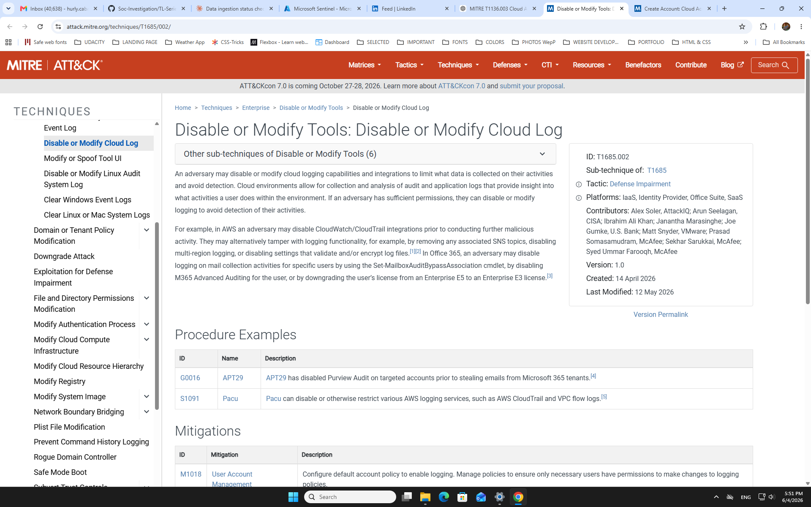
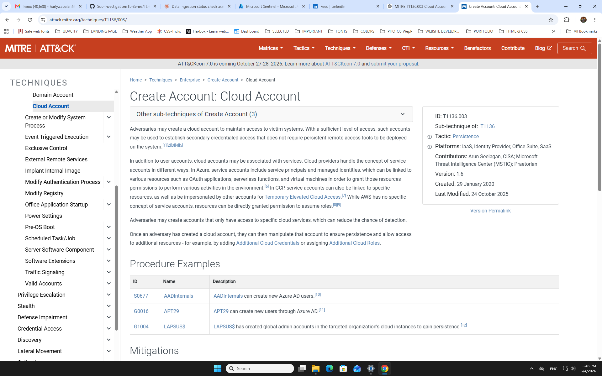
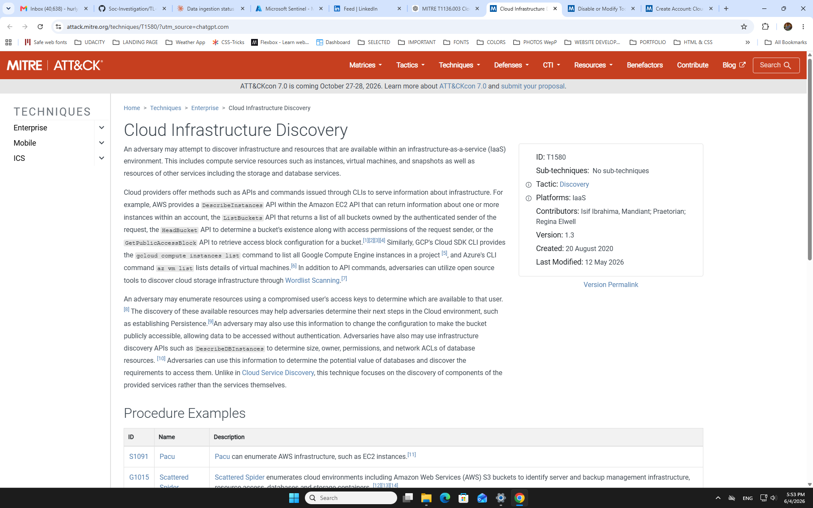

# TL-04 — Cloud-Only Cross-Cloud Attack
**Threat Lab | Cloud-First Pivot: AWS → GCP**

---

## S1 — Alert Summary

| Field | Details |
|---|---|
| **Case ID** | TL-04 |
| **Date** | June 3, 2026 |
| **Severity** | 🔴 Critical |
| **Actor** | `mirage@pkwork.onmicrosoft.com` |
| **Source IP** | 198.51.100.42 (RFC 5737 — lab simulation) |
| **Initial Signal** | AWSCloudTrail — ConsoleLogin + IAM enumeration from anomalous IP |
| **Verdict** | ✅ True Positive — Escalate to L2 immediately |

> **Cross-Scenario Note:** Actor `mirage@pkwork.onmicrosoft.com` from IP `198.51.100.42` was previously identified in TL-01 (Okta identity compromise). TL-04 confirms cross-environment persistence — same actor, same IP, different attack surface. This is a campaign, not an isolated incident.

### Severity Rubric

| Factor | Score | Reason |
|---|---|---|
| **Impact** | Critical | Backdoor accounts created on both AWS and GCP + compute deployed + logging destroyed on both clouds |
| **Confidence** | High | 40+ corroborated events across two cloud platforms from single attacker IP — same-second scripted execution confirmed |
| **Scope** | Critical | Full AWS IAM compromise + GCP project infrastructure deployed — blast radius spans two cloud environments |
| **Business Criticality** | Critical | CloudTrail deleted + GCP logging tampered = attacker actively blinding defenders while maintaining persistent access |

### Business Impact

CloudTrail deletion eliminates AWS audit trail retroactively — if Sentinel had not already ingested the logs, the entire AWS evidence chain would be unrecoverable. GCP logging tampering mirrors this on the second platform. Both actions together constitute a deliberate compliance breach: CloudTrail is a mandatory control under SOC 2, PCI-DSS, and most enterprise cloud security baselines. The compute instances deployed on both AWS and GCP represent active financial impact (resource hijacking for cryptomining or C2 infrastructure) and availability risk if used to attack internal services. The backdoor service account with `roles/owner` binding means the attacker retains full GCP project access even after primary credential rotation — data exfiltration scope of `GetObject` and `storage.objects.get` events requires L2 data classification review before the blast radius can be closed.

### Attack Timeline

| Time (UTC) | Platform | Event | Significance |
|---|---|---|---|
| 5:10:11 PM | AWS | `ConsoleLogin` | Initial access — attacker authenticates to AWS console |
| 5:10:11 PM | AWS | `GetCallerIdentity` | Attacker confirms their own identity and permission level |
| 5:10:11 PM | AWS | `DescribeVpcs`, `DescribeSubnets`, `DescribeSecurityGroups`, `DescribeNetworkInterfaces` | Full network topology mapping |
| 5:10:11 PM | AWS | `ListUsers`, `ListGroups`, `ListRoles`, `ListAccessKeys`, `ListKeys` | Full IAM enumeration |
| 5:10:11 PM | AWS | `GetObject` | Cloud storage data access |
| 5:10:11 PM | AWS | `CreateLoginProfile`, `AttachUserPolicy` | Privilege escalation — console access granted + policy attached |
| 5:10:11 PM | AWS | `DisassociateIamInstanceProfile` | Removes existing instance permissions — clears path for new profile |
| 5:10:11 PM | AWS | `ModifyInstanceAttribute` | EC2 instance tampered |
| 5:10:11 PM | AWS | `RunInstances` | Compute deployed — attacker infrastructure provisioned |
| 5:10:11 PM | AWS | `CreateUser` + `CreateAccessKey` | Backdoor IAM user created with programmatic access |
| 5:10:11 PM | AWS | `AuthorizeSecurityGroupIngress` | Inbound firewall rule opened |
| 5:10:11 PM | AWS | `DeleteTrail` | ⚠️ CloudTrail logging deleted — attacker blinding AWS detection |
| 5:14:39 PM | GCP | `storage.objects.list`, `storage.objects.get` | GCP storage recon and data access — 4 min after AWS |
| 5:14:39 PM | GCP | `SetIamPolicy`, `google.iam.admin.v1.SetIamPolicy` | GCP privilege escalation |
| 5:14:39 PM | GCP | `google.iam.admin.v1.CreateServiceAccount` x2 | Backdoor service accounts created |
| 5:14:39 PM | GCP | `google.iam.admin.v1.CreateServiceAccountKey` | Programmatic key for backdoor service account |
| 5:14:39 PM | GCP | `v1.compute.firewalls.insert` | GCP firewall rule opened |
| 5:14:39 PM | GCP | `v1.compute.instances.insert` x3 | GCP compute deployed — attacker infrastructure mirrored |
| 5:14:39 PM | GCP | `google.logging.v2.ConfigService` x2 | ⚠️ GCP logging configuration tampered — blinding GCP detection |

### What Happened (3-Sentence Story)
Attacker `mirage@pkwork.onmicrosoft.com` authenticated to AWS from IP `198.51.100.42` and within the same second executed a fully scripted compromise — enumerating the entire IAM structure, escalating privileges, deploying compute infrastructure, creating a backdoor IAM user with programmatic access, and deleting CloudTrail to blind defenders. Four minutes later at 5:14 PM, the same IP pivoted to GCP and mirrored the attack — accessing cloud storage, escalating via IAM policy manipulation, creating two backdoor service accounts including `backdoor-svc-gcp@pocaas-pro...` with a dedicated access key, deploying three compute instances, and tampering with GCP logging. The same-second execution across 40+ events on both platforms confirms automated tooling; the `DeleteTrail` on AWS and `google.logging.v2.ConfigService` manipulation on GCP confirm a deliberate anti-forensics playbook executed on both clouds simultaneously.

> **Note:** IP 198.51.100.42 uses RFC 5737 documentation range for safe public sharing. All AWS event timestamps show 5:10:11 PM — same-second clustering is consistent with scripted automation. In a live investigation, timestamp granularity and ingestion normalization would be verified before concluding scripted execution.

---

## S2 — 🔵 SC-200 | Sentinel + Defender XDR

### Investigation Queries (Chronological)

**Step 1 — AWS Event Overview**
```kql
AWSCloudTrail
| summarize EventCount = count() by EventName
| sort by EventCount desc
```
*Purpose: Establish full scope of AWS activity before filtering. Identify which event types are present.*



---

**Step 2 — GCP Event Overview**
```kql
GCPAuditLogs
| summarize EventCount = count() by methodName
| sort by EventCount desc
```
*Purpose: Mirror AWS recon on GCP side. Identify method types before pivoting to attacker IP.*



---

**Step 3 — AWS Attacker IP Filter**
```kql
AWSCloudTrail
| where SourceIpAddress == "198.51.100.42"
| project TimeGenerated, EventName, UserIdentityArn, SourceIpAddress, AWSRegion, ErrorCode
| sort by TimeGenerated asc
```
*Result: All AWS events originate from 198.51.100.42 — single attacker IP confirmed across entire AWS session.*



---

**Step 4 — DeleteTrail Detection**
```kql
AWSCloudTrail
| where SourceIpAddress == "198.51.100.42"
| where EventName == "DeleteTrail"
| project TimeGenerated, EventName, UserIdentityArn, SourceIpAddress
```
*Result: DeleteTrail confirmed — attacker destroyed CloudTrail logging to blind AWS-side detection. T1562.008.*



---

**Step 5 — GCP Attacker IP Filter**
```kql
GCPAuditLogs
| where RequestMetadata contains "198.51.100.42"
| project TimeGenerated, methodName, principalEmail, resourceName, severity
| sort by TimeGenerated asc
```
*Result: Same IP active on GCP 4 minutes after AWS. mirage@pkwork.onmicrosoft.com confirmed as GCP actor.*



---

**Step 6 — GCP Backdoor Service Account**
```kql
GCPAuditLogs
| where RequestMetadata contains "198.51.100.42"
| where methodName contains "CreateServiceAccount"
| project TimeGenerated, methodName, principalEmail, resourceName
```
*Result: Two events — CreateServiceAccount + CreateServiceAccountKey at same second. Backdoor account `backdoor-svc-gcp@pocaas-pro...` confirmed. Scripted execution confirmed.*



---

**Step 7 — Unified Cross-Cloud Timeline**
```kql
AWSCloudTrail
| where SourceIpAddress == "198.51.100.42"
| project TimeGenerated, EventName, UserIdentityArn, SourceIpAddress
| union (
    GCPAuditLogs
    | where RequestMetadata contains "198.51.100.42"
    | project TimeGenerated, EventName=methodName, UserIdentityArn=principalEmail, SourceIpAddress="198.51.100.42"
)
| sort by TimeGenerated asc
```
*Result: 40 events unified across AWS and GCP. Pivot timestamp confirmed — AWS 5:10:11 PM → GCP 5:14:39 PM. 4-minute gap between cloud environments. Same IP bridges both.*



---

### FP Branch
> **What would make this benign?**
- Authorized cloud administrator running scripted infrastructure deployment from approved automation account
- `DeleteTrail` part of approved log rotation or cost-reduction policy with change ticket
- GCP service account creation part of approved DevOps pipeline with known naming convention
- `backdoor-svc-gcp` naming is coincidental test/dev account — not attacker-controlled

> **What log disproves malice?**
- Change ticket or CAB approval for CloudTrail deletion at 5:10 PM UTC
- Known automation pipeline explaining same-second execution of 40+ events
- `backdoor-svc-gcp@pocaas-pro...` appearing in approved service account registry
- `198.51.100.42` appearing on authorized IP allowlist for cloud admin access

> **Decision: Close or Escalate?**
- **Escalate immediately to L2.** No change ticket found. Same-second execution of 40+ events = automated tooling. `DeleteTrail` + `google.logging.v2.ConfigService` = deliberate anti-forensics on both clouds simultaneously. `backdoor-svc-gcp` naming = explicit persistence. Cross-cloud pivot in 4 minutes = coordinated attack campaign. Previously confirmed actor from TL-01.

---

## S3 — MITRE ATT&CK Mapping

| Tactic | Technique | Evidence |
|---|---|---|
| Initial Access | T1078.004 — Valid Accounts: Cloud Accounts | ConsoleLogin to AWS from 198.51.100.42 |
| Discovery | T1580 — Cloud Infrastructure Discovery | DescribeVpcs, DescribeSubnets, DescribeSecurityGroups, DescribeNetworkInterfaces |
| Discovery | T1087.004 — Account Discovery: Cloud Account | ListUsers, ListGroups, ListRoles, ListAccessKeys |
| Discovery | T1619 — Cloud Storage Object Discovery | GetObject, storage.objects.list, storage.objects.get |
| Privilege Escalation | T1078.004 — Valid Accounts: Cloud Accounts | AttachUserPolicy, SetIamPolicy — permissions elevated on both platforms |
| Persistence | T1136.003 — Create Account: Cloud Account | CreateUser + CreateAccessKey (AWS), CreateServiceAccount + CreateServiceAccountKey (GCP) |
| Persistence | T1098.001 — Account Manipulation: Additional Cloud Credentials | CreateAccessKey on AWS, CreateServiceAccountKey on GCP |
| Defense Evasion | T1562.008 — Impair Defenses: Disable Cloud Logs | DeleteTrail (AWS), google.logging.v2.ConfigService (GCP) |
| Impact | T1496 — Resource Hijacking | RunInstances (AWS), v1.compute.instances.insert x3 (GCP) — attacker compute deployed |
| Lateral Movement | T1078.004 — Valid Accounts reused across platforms | Same credential set `mirage@pkwork.onmicrosoft.com` active on both AWS and GCP — 4-minute pivot window confirms cross-cloud credential reuse, not separate compromise |







---

## S4 — Mitigation

### Immediate (0–1 hour)
- [ ] Disable `mirage@pkwork.onmicrosoft.com` across all cloud platforms
- [ ] Block IP `198.51.100.42` at AWS Security Group, GCP firewall, and network perimeter
- [ ] Revoke AWS backdoor IAM user access key created during 5:10 PM session
- [ ] Delete AWS backdoor IAM user and attached policies
- [ ] Disable and delete GCP backdoor service account `backdoor-svc-gcp@pocaas-pro...`
- [ ] Revoke all GCP service account keys created during 5:14 PM session
- [ ] Re-enable AWS CloudTrail immediately — determine what was logged before deletion
- [ ] Audit GCP logging configuration — restore to known-good state
- [ ] Terminate all EC2 instances launched by attacker in this session
- [ ] Terminate all GCP compute instances inserted during 5:14 PM session
- [ ] Revoke all inbound security group rules added by `AuthorizeSecurityGroupIngress`
- [ ] Remove GCP firewall rules inserted by `v1.compute.firewalls.insert`

### Short-term (24–72 hours)
- [ ] Full IAM audit on AWS — identify all policy changes, role assignments, and unknown accounts from last 30 days
- [ ] Full GCP IAM audit — review all SetIamPolicy events and service account grants
- [ ] Determine scope of `GetObject` and `storage.objects.get` — what data was accessed
- [ ] Review all EC2 and GCP compute instances for exfiltration activity or crypto mining
- [ ] Restore CloudTrail to all regions — verify no other trails were deleted
- [ ] Identify what existed in GCP logging config before `ConfigService` modification
- [ ] Cross-reference with TL-01 findings — same actor, assess full campaign scope

### Long-term
- [ ] Implement SCP (Service Control Policy) on AWS — prevent CloudTrail deletion without break-glass approval
- [ ] Implement GCP Organization Policy — restrict service account creation to approved projects
- [ ] Enforce MFA on all AWS root and IAM admin accounts
- [ ] Implement Conditional Access on GCP — block sign-in from non-approved IP ranges
- [ ] Enable AWS GuardDuty — automated detection of IAM anomalies and CloudTrail tampering
- [ ] Enable GCP Security Command Center — automated detection of IAM policy changes and logging tampering
- [ ] Implement JIT access for cloud admin operations on both platforms

---

## Control Failure Analysis

| Layer | Platform | Control | Failure Mode |
|---|---|---|---|
| Identity | AWS | IAM MFA Policy | Console login permitted without MFA from anomalous IP |
| Identity | AWS | IAM Privilege Policy | AttachUserPolicy executable without approval — no JIT in place |
| Identity | GCP | GCP IAM Policy | SetIamPolicy executable without approval or alerting |
| Persistence | AWS | IAM User Lifecycle | CreateUser + CreateAccessKey unrestricted — no approval workflow |
| Persistence | GCP | Service Account Policy | Service account creation unrestricted — no naming policy enforced |
| Detection | AWS | CloudTrail | DeleteTrail permitted without SCP guard — logging fully destroyed |
| Detection | GCP | Cloud Logging | Logging configuration modifiable without alert or approval |
| Detection | Sentinel | Analytics Rules | No alert fired on DeleteTrail or IAM enumeration — discovered via hunting |
| Compute | AWS | EC2 Launch Policy | RunInstances executable without approval — attacker compute deployed |
| Compute | GCP | Compute Policy | v1.compute.instances.insert unrestricted — attacker compute deployed on GCP |

---

## S5 — 🟠 AZ-500 | D1–D4 Controls
⚠️ THEORETICAL — Hands-on Month 2–3

**D1 — Identity & Access**
- AWS: Enforce MFA for all IAM console logins — block unauthenticated console access
- AWS: Implement SCP to deny `cloudtrail:DeleteTrail` except for break-glass role
- GCP: Implement Organization Policy `constraints/iam.disableServiceAccountCreation` on non-approved projects
- GCP: Enforce domain-restricted sharing — prevent external identities from assuming GCP roles
- Both: Implement JIT cloud access — require approval for privilege escalation operations

**D2 — Secure Networking**
- AWS: VPC network ACL — restrict console and API access to known corporate IP ranges
- GCP: VPC Service Controls — isolate sensitive GCP resources behind access perimeters
- Both: Block `198.51.100.42` and add to threat intelligence blocklist for all cloud perimeters

**D3 — Compute + Storage**
- AWS: EC2 launch templates with mandatory approval tags — block untagged `RunInstances`
- GCP: Org Policy `constraints/compute.vmExternalIpAccess` — restrict external IPs on new instances
- Both: Enable cloud storage audit logging — alert on bulk `GetObject` / `storage.objects.get`
- AWS: S3 Block Public Access enabled by default at account level

**D4 — Security Operations**
- AWS: GuardDuty rule — alert on `DeleteTrail`, IAM enumeration, and CreateUser from anomalous IP
- GCP: Security Command Center — alert on `SetIamPolicy` and service account key creation
- Sentinel analytics rule: `AWSCloudTrail | where EventName == "DeleteTrail"` → Critical alert immediate
- Sentinel analytics rule: `GCPAuditLogs | where methodName contains "CreateServiceAccount"` from non-approved principal → High alert
- Playbook: Auto-disable IAM user + block IP on CloudTrail DeleteTrail detection
- Automation rule: Notify L2 + snapshot account state on cross-cloud activity from same IP within 10 minutes

---

## Closure Criteria
- [x] Root cause assessed — activity consistent with use of compromised `mirage@pkwork.onmicrosoft.com` credentials in a scripted cross-cloud attack
- [x] Blast radius mapped — AWS IAM fully enumerated, backdoor user created, compute deployed, CloudTrail deleted; GCP storage accessed, IAM escalated, backdoor service account created, compute deployed, logging tampered
- [x] Containment actions defined — account disable, IP block, backdoor account deletion, compute termination, logging restoration, firewall rule removal
- [x] Ownership assigned — L2 escalation with full evidence package; cross-reference TL-01 for campaign scope
- [x] Documentation complete — all queries, screenshots, MITRE mapping, control failures, unified timeline recorded

---

## S6 — Lessons Learned + Interview Q&A

### Biggest Lesson
**Attackers don't stay in one cloud.** The 4-minute gap between AWS (5:10 PM) and GCP (5:14 PM) is the most important finding in this investigation — same IP, same actor, two separate cloud environments, same automated playbook. Single-platform monitoring would have seen half the attack. The unified KQL query bridging both tables is what made the pivot visible.

### What I Got Wrong
- **Schema mismatch:** GCP field `requestMetadata_callerIp` was not directly queryable — used `RequestMetadata contains "198.51.100.42"` as workaround. Always verify field schema before building cross-table queries
- **Missed on first pass:** `DeleteTrail` was buried in the middle of 18 AWS events — recon phase looked like noise. Reviewing every event type in the full list before filtering is mandatory, not optional
- **Assumption corrected:** Initially expected `ResourceOriginalState` to contain the full backdoor service account name — field was empty. Used earlier screenshot to capture `backdoor-svc-gcp@pocaas-pro...` naming. Never rely on a single field for IOC extraction

### Interview Q&A

**Q: How did you detect this attack?**
> Proactive hunting in AWSCloudTrail — queried all events from IP 198.51.100.42, identified full IAM enumeration + CreateUser + DeleteTrail sequence. Pivoted to GCPAuditLogs using the same IP and found the attack mirrored 4 minutes later. Built a unified KQL query with union across both tables to produce a single chronological kill chain.

**Q: What is the significance of the 4-minute gap between AWS and GCP activity?**
> It's the pivot window. AWS was compromised at 5:10 PM, CloudTrail was deleted to blind defenders, then the attacker moved to GCP at 5:14 PM using the same credential set. That 4-minute gap represents the time to complete AWS persistence before shifting focus. Without the cross-table union query, the GCP activity would have appeared as an unrelated event.

**Q: Why is DeleteTrail critical versus other events in the AWS timeline?**
> DeleteTrail is a T1562.008 — Impair Defenses. It's not reconnaissance, it's not persistence, it's specifically anti-forensics. The attacker destroyed the audit log after establishing their backdoor. Without Sentinel ingesting CloudTrail before deletion, the entire AWS-side evidence chain would be gone. This is why real-time SIEM ingestion is non-negotiable — the source log can be deleted but Sentinel already has it.

**Q: What controls failed here?**
> Ten controls failed across identity, detection, and compute layers on both platforms. The two most critical: no SCP preventing CloudTrail deletion on AWS, and no Organization Policy restricting service account creation on GCP. Either one working would have broken the attacker's anti-forensics or persistence playbook.

**Q: What is the blast radius?**
> Confirmed AWS: full IAM enumeration, privilege escalation, backdoor user with programmatic access, EC2 compute deployed, CloudTrail deleted, security group opened. Confirmed GCP: storage data accessed, IAM escalated, backdoor service account `backdoor-svc-gcp@pocaas-pro...` with access key, three compute instances deployed, logging tampered. Unknown: what data was in the S3 objects and GCP storage buckets that were accessed — requires L2 data classification review.

**Q: How does this relate to TL-01?**
> Same actor `mirage@pkwork.onmicrosoft.com`, same source IP `198.51.100.42`. TL-01 was an identity-layer attack via Okta — super admin escalation, MFA wipe, credential dumping on the endpoint. TL-04 shows the same actor moving laterally into cloud infrastructure after the initial identity compromise. This is not two separate incidents — it is one campaign. TL-01 was the entry point; TL-04 is the expansion. The full campaign scope requires both investigations to be reviewed together by L2.

---

*Investigation by Hurly Cabalan | Microsoft Sentinel 6-Vendor Training Lab | SC-200 Investigation Framework*
*GitHub: [github.com/hurlycabalan/Soc-Investigation](https://github.com/hurlycabalan/Soc-Investigation)*
